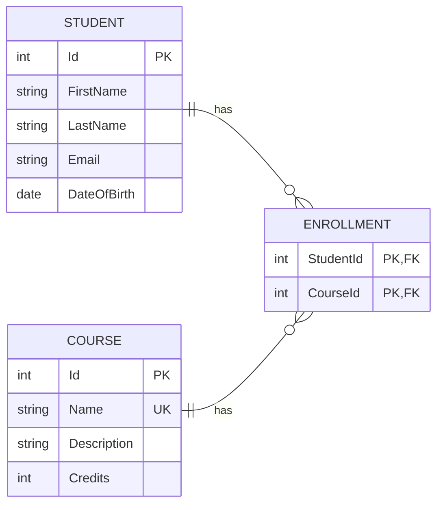

# Student Course Management Database Structure

`Enrollment` connects students and courses. Its `StudentId` and `CourseId` columns form a composite primary key, preventing the same student from being enrolled in the same course more than once.

`Course.Name` is marked as a unique key. These constraints will be implemented later in `SchoolDbContext`.
