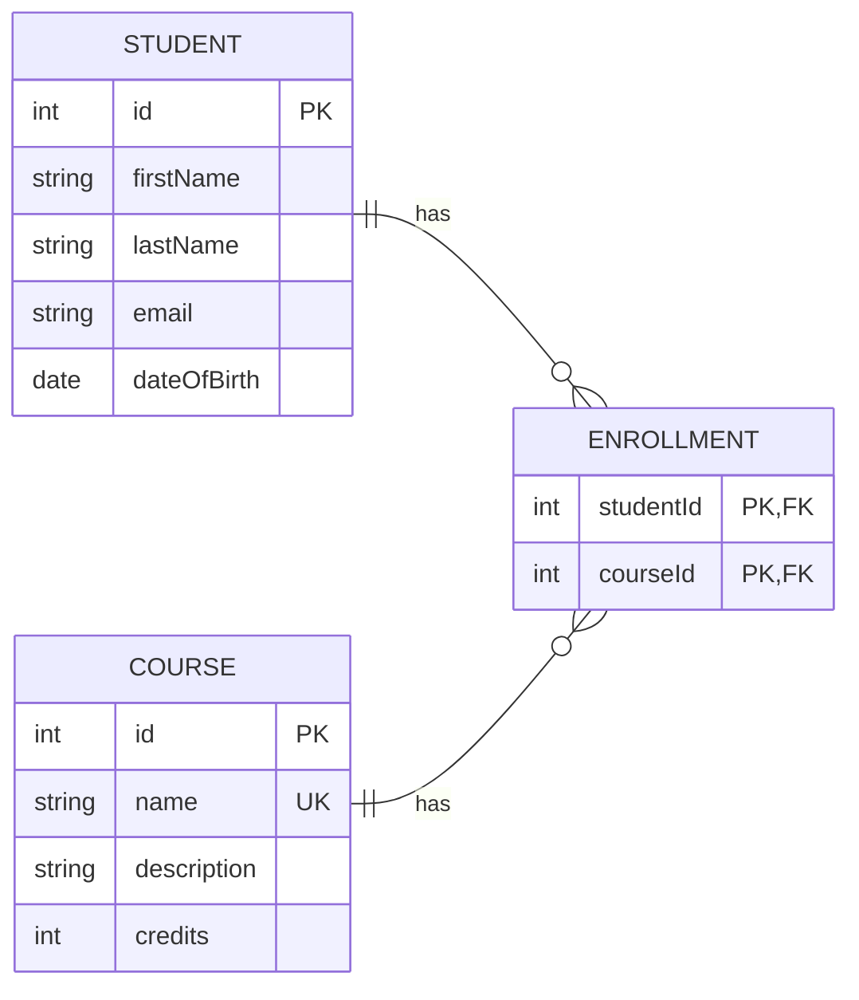
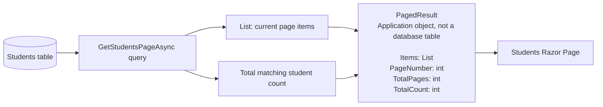
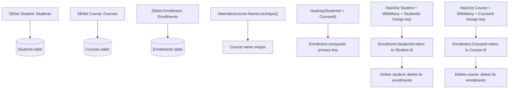

# Student Course Management Database Structure



`ENROLLMENT` is the connection table between `STUDENT` and `COURSE`.

`PagedResult<T>` is deliberately shown separately because it is an application result object, not a database entity or table.



- A student can have zero or many enrollments.
- A course can have zero or many enrollments.
- Each enrollment connects exactly one student to exactly one course.
- `studentId` and `courseId` together form the primary key, so a student cannot be enrolled in the same course twice.
- `name UK` means that every course name must be unique.

## How `SchoolDbContext` Creates the Structure



The diagram above summarizes the configuration. These are the exact lines in `SchoolDbContext.cs` that create each rule.

### Tables

```csharp
public DbSet<Student> Students => Set<Student>();
public DbSet<Course> Courses => Set<Course>();
public DbSet<Enrollment> Enrollments => Set<Enrollment>();
```

Each `DbSet<T>` tells EF Core that `T` should be stored as a table.

### Unique course name

```csharp
modelBuilder.Entity<Course>()
    .HasIndex(course => course.Name)
    .IsUnique();
```

This creates a unique index on the `Courses.Name` column.

## `PagedResult<T>` is not a database table

`Models/PagedResult.cs` is a model used by the application to return one page of query results:

```csharp
public class PagedResult<T>
{
    public List<T> Items { get; init; } = [];
    public int PageNumber { get; init; }
    public int TotalPages { get; init; }
    public int TotalCount { get; init; }
}
```

It does **not** appear in the entity-relationship diagram because EF Core does not store it as a table.

```text
No DbSet<PagedResult<T>> exists in SchoolDbContext.
No key, relationship, or migration maps it to PostgreSQL.
```

For example, `GetStudentsPageAsync` queries the `Students` table, then returns a `PagedResult<Student>` containing:

- `Items`: only the students for the requested page.
- `PageNumber`: the valid page currently displayed.
- `TotalPages`: the number of available pages.
- `TotalCount`: the total number of matching students.

`PagedResult<T>` is therefore a **temporary application result object**, not a persisted database entity.

### Enrollment composite primary key

```csharp
modelBuilder.Entity<Enrollment>()
    .HasKey(enrollment => new { enrollment.StudentId, enrollment.CourseId });
```

Together, `StudentId` and `CourseId` identify one enrollment. That means the pair cannot appear twice.

### Enrollment-to-student relationship

```csharp
modelBuilder.Entity<Enrollment>()
    .HasOne<Student>()
    .WithMany()
    .HasForeignKey(enrollment => enrollment.StudentId)
    .OnDelete(DeleteBehavior.Cascade);
```

An enrollment has one student, while a student can have many enrollments. `StudentId` is the foreign key, and cascade delete removes enrollments if that student is deleted.

### Enrollment-to-course relationship

```csharp
modelBuilder.Entity<Enrollment>()
    .HasOne<Course>()
    .WithMany()
    .HasForeignKey(enrollment => enrollment.CourseId)
    .OnDelete(DeleteBehavior.Cascade);
```

An enrollment has one course, while a course can have many enrollments. `CourseId` is the foreign key, and deleting the course deletes its related enrollments.
