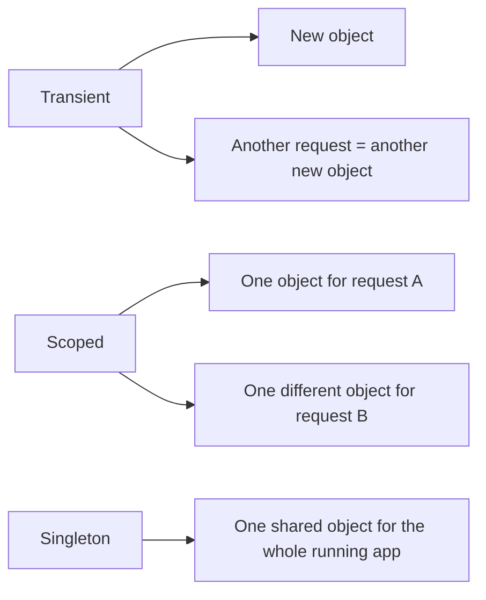
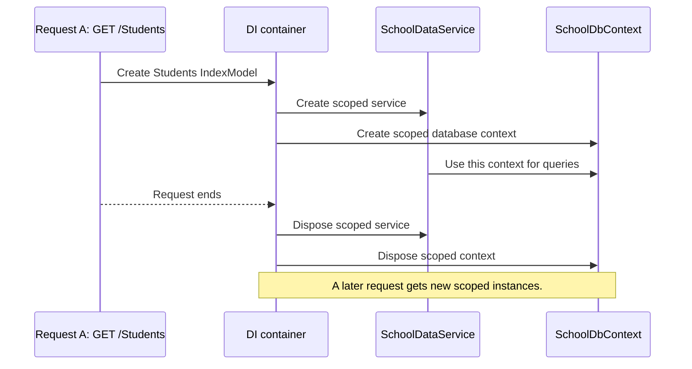
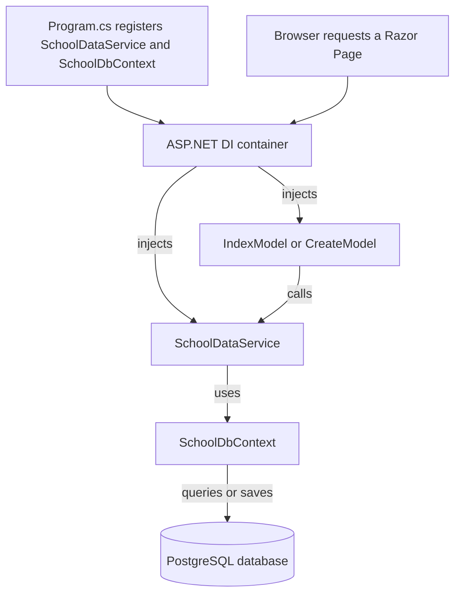

# Dependency Injection in this project

## The simple idea

**Dependency injection (DI)** means that a class receives the objects it needs instead of creating them itself.

For example, `IndexModel` needs a `SchoolDataService` to load dashboard data.

Without DI, it might try to create one itself:

```csharp
// Avoid doing this here.
SchoolDataService schoolData = new SchoolDataService(...);
```

But `SchoolDataService` also needs a `SchoolDbContext`, and that context needs database settings. The page should not need to know how to build all of that.

With DI, the page states what it needs:

```csharp
public class IndexModel(SchoolDataService schoolData) : PageModel
```

ASP.NET creates and supplies `schoolData` when it creates `IndexModel`.


## Where the dependencies are registered

`Program.cs` tells ASP.NET which objects it is allowed to provide:

```csharp
builder.Services.AddDbContext<SchoolDbContext>(options =>
    options.UseNpgsql(connectionString));

builder.Services.AddScoped<SchoolDataService>();
```

These registrations mean:

```text
SchoolDbContext     → ASP.NET knows how to create one with the database connection settings.
SchoolDataService   → ASP.NET knows how to create one when a class asks for it.
```

## DI lifetimes

A **lifetime** tells ASP.NET how long it should keep an object before creating a new one.

| Lifetime | Meaning | Typical use |
| --- | --- | --- |
| `Transient` | Create a new object every time it is requested. | Small, stateless helper services. |
| `Scoped` | Create one object per web request, then reuse it during that request. | Database contexts and services that use them. |
| `Singleton` | Create one object for the entire application lifetime. | Shared configuration or a safe, stateless shared service. |



### The lifetime in this app

This project registers its data service as scoped:

```csharp
builder.Services.AddScoped<SchoolDataService>();
```

`AddDbContext<SchoolDbContext>(...)` also registers `SchoolDbContext` as **scoped by default**.

So, for one browser request, such as `GET /Students/Create`:

```text
Start request
→ ASP.NET creates one SchoolDataService
→ ASP.NET creates one SchoolDbContext
→ CreateModel uses the service
→ the service uses that context
→ request ends
→ ASP.NET disposes the scoped objects
```

The next browser request receives new scoped instances.



`Scoped` is a good fit here because a database context should not be shared by every user and every request for the whole lifetime of the application.

## How it is used in this project

### 1. A Razor Page receives the service

`Pages/Index.cshtml.cs` needs school data for the dashboard:

```csharp
public class IndexModel(SchoolDataService schoolData) : PageModel
{
    public async Task OnGetAsync()
    {
        StudentCount = await schoolData.GetStudentCountAsync();
    }
}
```

`schoolData` is provided by DI. `IndexModel` does not create it with `new`.

### 2. The service receives the database context

`SchoolDataService` needs a way to query and save database data:

```csharp
public class SchoolDataService(SchoolDbContext db)
```

`db` is also provided by DI.

### The complete chain



## Why use DI?

DI keeps each class focused on its own job:

```text
Razor Page        → handle the web request and prepare page data
SchoolDataService → perform school data operations
SchoolDbContext   → communicate with the database
Program.cs        → configure how these objects are created
```

It also makes replacement easier. For example, a test could provide a fake data service instead of connecting to a real database.

## The pattern to recognize

When you see a class declaration like this:

```csharp
public class CreateModel(SchoolDataService schoolData) : PageModel
```

read it as:

> “To create `CreateModel`, ASP.NET must give it a `SchoolDataService`.”

For that to work, `SchoolDataService` must have been registered in `Program.cs`.
