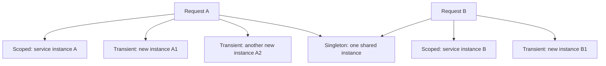
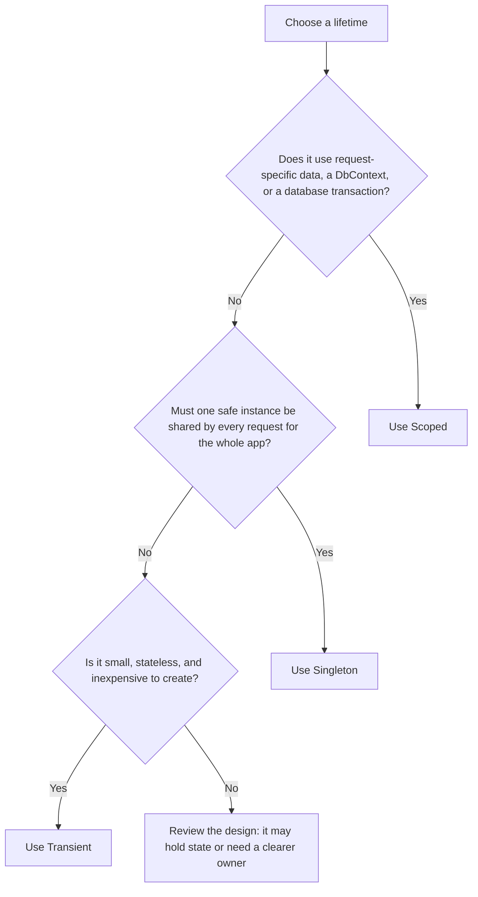

# DI lifetimes: Scoped, Transient, and Singleton

A DI **lifetime** tells ASP.NET how long to keep an object before creating another one.

| Lifetime | Registration | How long one instance lives | Use it when | Example |
| --- | --- | --- | --- | --- |
| **Scoped** | `AddScoped<T>()` | One instance per DI scope. In a web app, that normally means one per HTTP request. | The object represents request-specific work or uses a `DbContext`. | `SchoolDataService`, `SchoolDbContext` |
| **Transient** | `AddTransient<T>()` | A new instance every time a class requests it. | The object is small, stateless, cheap to create, and has no shared state. | A simple formatter or calculator service |
| **Singleton** | `AddSingleton<T>()` | One instance for the entire lifetime of the running application. | The object is safe to share across all requests/users and does not hold request-specific data. | Shared configuration or a thread-safe cache |

## What happens across two requests?



## Which one should I use?



## This project

```csharp
builder.Services.AddDbContext<SchoolDbContext>(options =>
    options.UseNpgsql(connectionString));

builder.Services.AddScoped<SchoolDataService>();
```

`AddDbContext` registers `SchoolDbContext` as **scoped by default**. `SchoolDataService` is also scoped.

That gives one request its own matching pair:

```text
GET /Students
→ one SchoolDataService
→ one SchoolDbContext
→ request ends
→ ASP.NET disposes scoped objects
```

The next request receives new instances.

### If `SchoolDataService` were transient

```text
GET /Students
→ IndexModel requests SchoolDataService
→ ASP.NET creates SchoolDataService instance A
→ another class requests SchoolDataService during the same request
→ ASP.NET creates a separate SchoolDataService instance B
→ request ends
→ ASP.NET disposes container-created disposable transient objects
```

Each request for a transient service receives a new instance, even during one HTTP request.

### If `SchoolDataService` were a singleton

```text
Application starts
→ ASP.NET creates one SchoolDataService instance
→ GET /Students uses that same instance
→ GET /Students/Create uses that same instance
→ every later request uses that same instance
→ application stops
→ ASP.NET disposes the singleton
```

That would be a poor choice for `SchoolDataService` because it uses a `SchoolDbContext`, which is scoped and belongs to one request.

## Important safety rule

Do not make a `Singleton` depend directly on a `Scoped` service.

For example, a singleton `SchoolDataService` should not hold one `SchoolDbContext` forever. A database context belongs to one request/scope and should be disposed after that scope ends.
