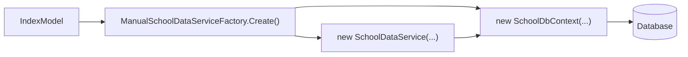
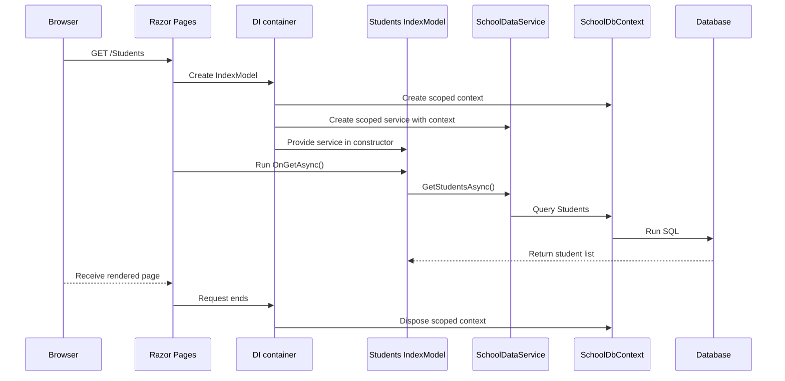
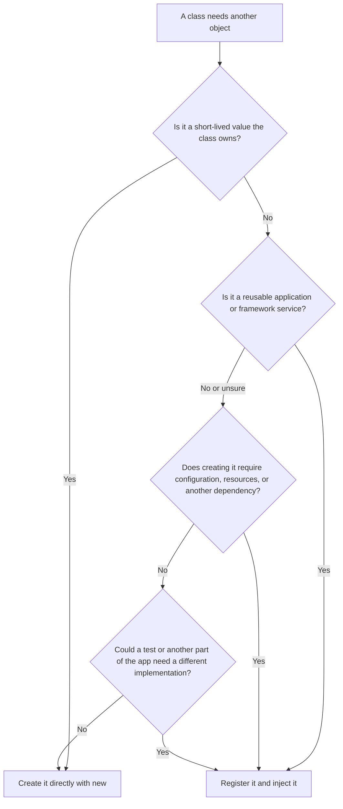

# Dependency injection versus manual construction

This project has two versions of the same idea:

| Version | Location | How a Page Model gets `SchoolDataService` |
| --- | --- | --- |
| Dependency injection | `razor-exercise` | ASP.NET provides it through the constructor. |
| Manual construction | `razor-exercise-copy` | The Page Model calls `ManualSchoolDataServiceFactory.Create()`. |

## The key difference

### With dependency injection

The Page Model declares what it needs:

```csharp
public class IndexModel(SchoolDataService schoolData) : PageModel
```

It does **not** create the service itself.


### With manual construction

The Page Model creates the service itself:

```csharp
private readonly SchoolDataService schoolData =
    ManualSchoolDataServiceFactory.Create();
```



## Startup comparison

| Step | DI version: `razor-exercise` | Manual version: `razor-exercise-copy` |
| --- | --- | --- |
| Configure database creation | `AddDbContext<SchoolDbContext>(...)` | `ManualSchoolDataServiceFactory.Configure(connectionString)` |
| Register data service | `AddScoped<SchoolDataService>()` | No registration |
| Create a service for a page | ASP.NET does it when needed | The page calls the factory |
| Create a database context | ASP.NET does it when creating the service | The factory does it |
| Manage scoped lifetime | ASP.NET | Manual code must manage it |

## Request trace: `GET /Students`



In the DI version, `IndexModel` never needs `new SchoolDataService(...)` or `new SchoolDbContext(...)`.

## Why the manual version is harder

| Concern | DI version | Manual version |
| --- | --- | --- |
| Dependencies are visible | The constructor lists them. | They can be hidden in fields or factory calls. |
| Construction details | Centralized in `Program.cs`. | Factory/setup code must be maintained manually. |
| Lifetime and disposal | ASP.NET manages scoped objects per request. | The application must make sure created contexts are disposed. |
| Testing | A test can provide a fake service to the constructor. | The static factory must be changed, replaced, or worked around. |
| Adding a new dependency | Update registration; consuming class declares it. | Update factory and possibly several manual creation sites. |

## The lesson

Both approaches can create a working app. The useful DI pattern is:

```text
Class declares what it needs
→ DI container creates the object graph
→ ASP.NET manages the registered lifetimes
```

For example:

```text
IndexModel needs SchoolDataService
SchoolDataService needs SchoolDbContext
Program.cs tells ASP.NET how to create both
```

> Note: `AddRazorPages()` still uses ASP.NET's own dependency-injection system in both projects. The manual copy only removes DI for this app's `SchoolDataService` and `SchoolDbContext` construction.

## When should I use DI?

Use DI when a class needs a **shared application service** and should focus on using it rather than knowing how to build it.

For this project:

```text
IndexModel needs to load school data
→ it should use SchoolDataService
→ it should not need to know connection strings or DbContextOptions
→ inject SchoolDataService
```

### Decision mind map



### Self-checklist

Before writing `new SomeType(...)`, ask:

| Question | If the answer is yes |
| --- | --- |
| Does this object communicate with a database, API, file system, cache, or email service? | Usually use DI. |
| Does creating it require a connection string, options, credentials, or other setup? | Usually use DI. |
| Will more than one page, service, or class use it? | Usually use DI. |
| Should ASP.NET manage its lifetime or dispose it? | Use DI. |
| Would a test benefit from replacing it with a fake version? | Use DI. |
| Is it merely data created for this one operation, such as `new Student()` or `new ValidationResult(...)`? | Create it directly. |
| Is it a small helper with no configuration, no resources, and no useful alternative implementation? | Creating it directly can be fine. |

### Examples in this project

| Object | DI or `new`? | Why |
| --- | --- | --- |
| `SchoolDbContext` | DI | It needs database configuration and should be disposed at the end of a request. |
| `SchoolDataService` | DI | It is a reusable service that depends on `SchoolDbContext`. |
| `Student` | `new Student()` | It is ordinary page/form data, not a shared application service. |
| `ValidationResult` | `new ValidationResult(...)` | It is a short-lived validation message created for one rule. |

The short rule is:

```text
Application service with setup or lifetime needs → DI
Short-lived data object owned by this operation  → new
```
