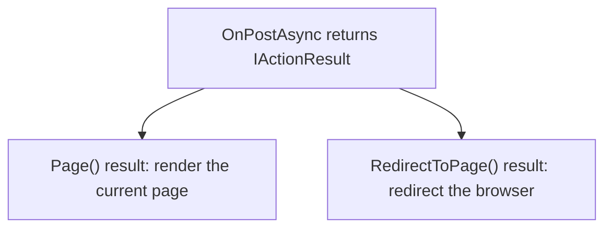

# Interface types in C#

## The central idea

An **interface is a type** because it describes what kind of value code can accept, store, or return.

For example:

```csharp
IActionResult result;
```

This says:

> `result` will refer to an object that follows the `IActionResult` contract.

An interface describes required members or behavior. A class provides the actual implementation.

```csharp
public class Student : IValidatableObject
```

Here:

```text
IValidatableObject → interface type / contract
Student            → class that implements the contract
```

## Why return an interface type?

One interface can describe several different concrete objects.

```csharp
public async Task<IActionResult> OnPostAsync()
{
    if (!ModelState.IsValid)
    {
        return Page();
    }

    return RedirectToPage("./Index");
}
```

Both results follow the `IActionResult` contract, even though they do different things:



The method promises an `IActionResult`; it does not promise one specific concrete result class.

## You cannot create an interface directly

This is not allowed:

```csharp
// new IActionResult(); // Not allowed
```

An interface is a contract, not a complete object. Create a class that implements it instead, or call a method such as `Page()` that creates a suitable result object.

## Common interface types

You do **not** need to memorize this table. Learn the ones you see, then look up others when a problem needs one.

| Interface type | Plain meaning | Use it when | Example in or near this project |
| --- | --- | --- | --- |
| `IEnumerable<T>` | A sequence of `T` items that can be read one at a time. | A method returns zero or more items and callers only need to read/loop through them. | `IEnumerable<ValidationResult>` from `Validate`. |
| `ICollection<T>` | A collection of `T` items that can be read and changed. | Code needs to add/remove items and know the count. | Often used for navigation collections in EF Core models. |
| `IList<T>` | An ordered, changeable collection of `T` items. | Code needs collection changes plus index access such as `[0]`. | A `List<Student>` is one concrete list type. |
| `IDictionary<TKey, TValue>` | A set of key/value pairs. | You look up a value by a key. | `ViewData["Title"]` behaves like key/value storage. |
| `IAsyncEnumerable<T>` | An asynchronous sequence of `T` items. | Items arrive over time and should be processed asynchronously. | Useful for large streams; not required by the current list queries. |
| `IDisposable` | An object has resources that must be cleaned up. | The object uses resources such as files, streams, or database connections. | `DbContext` is disposed after its DI scope ends. |
| `IComparable<T>` | An object can compare itself with another object of the same type. | You need custom sorting rules for your own class. | Could define how a custom value object sorts. |
| `IEquatable<T>` | An object can compare itself for equality with another object of the same type. | Your own type needs a clear equality rule. | Useful for custom value-like types. |
| `IValidatableObject` | An object can provide custom validation results. | Attributes such as `[Required]` cannot express a validation rule. | `Student` checks that its date of birth is not in the future. |
| `IActionResult` | An object describes an HTTP response action. | A Razor Page handler can return different web outcomes. | `OnPostAsync` returns `Page()` or `RedirectToPage(...)`. |

## Generic interface types: `<T>`

`T` means “the type of one item.”

```csharp
IEnumerable<ValidationResult>
```

means:

> A sequence whose items are `ValidationResult` objects.

More examples:

```csharp
IEnumerable<Student>       // sequence of Student objects
IEnumerable<string>        // sequence of text values
IDictionary<string, int>   // text keys with integer values
```

## A quick decision guide

```text
Does a framework require an interface?
→ Use that interface.
  Example: custom model validation → IValidatableObject

Does a method return several items?
→ Consider IEnumerable<T>.

Does the method need to return one of several HTTP outcomes?
→ IActionResult is appropriate for a page handler.

Does the object own a resource that must be cleaned up?
→ It may implement IDisposable.
```

The main habit is to read an interface type as a promise:

```text
IEnumerable<ValidationResult>
→ “I will provide a readable sequence of validation errors.”

IActionResult
→ “I will provide an HTTP response result.”
```
