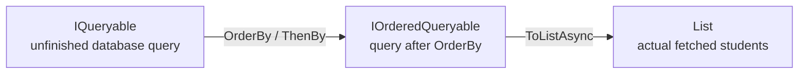

# Interface types used in this project

These are **interface types**, not “interface methods.” An interface type describes what a value can do or what kind of value a method can return.

For example:

```csharp
public IReadOnlyList<SortOption> SortOptions { get; }
```

means:

> `SortOptions` is a read-only ordered list whose items are `SortOption` objects.

## Interfaces currently used

| Interface type | Where it appears | Plain meaning | What it does here |
| --- | --- | --- | --- |
| `IReadOnlyList<SortOption>` | `Pages/Students/Index.cshtml.cs` | An ordered collection that callers can read but not change through this interface. | Exposes the sort-dropdown options. The page/component can loop through them and read the count, but cannot call `Add` or `Remove` through `IReadOnlyList`. |
| `IQueryable<Student>` | `SchoolDataService.GetStudentsAsync` and `GetStudentsPageAsync` | A database query that is still being built. | Starts with `db.Students`, then conditionally adds filtering and sorting before EF Core executes it. |
| `IOrderedQueryable<Student>` | `SchoolDataService.GetStudentsPageAsync` | A query that has an ordering applied. | Stores the query after the selected `OrderBy`/`ThenBy` rules have been chosen, so pagination can be applied to the correctly sorted records. |
| `IQueryable<Course>` | `SchoolDataService.GetCoursesAsync` and `GetCoursesPageAsync` | A database query for courses that is still being built. | Allows an optional course-name search filter and then sorting/pagination before execution. |
| `IEnumerable<ValidationResult>` | `Student.Validate` | A readable sequence of validation errors. | Lets custom validation return zero, one, or many `ValidationResult` objects. A valid student returns an empty sequence. |
| `IEnumerable<int>` | `SchoolDataService.EnrollStudentInCoursesAsync` | A readable sequence of integer IDs. | Lets the service accept selected course IDs from any sequence type, such as a `List<int>` or an array. |
| `IValidatableObject` | `Models/Student.cs` | A .NET custom-validation contract. | Tells ASP.NET/.NET to call `Student.Validate(...)` during model validation. |
| `IActionResult` | Razor Page handlers such as `OnPostAsync` and `OnGetAsync` | A result that tells ASP.NET what HTTP response to produce. | Allows the same handler to return `Page()`, `RedirectToPage(...)`, `NotFound()`, and similar outcomes. |

## How the query interfaces relate



The important boundary is:

```text
IQueryable<T>          → query instructions; data has not been fetched yet
ToListAsync()          → execute the query
List<T>                → actual objects returned from the database
```

## Why `IReadOnlyList<SortOption>` is used

`IndexModel` creates a list of sort choices:

```csharp
public IReadOnlyList<SortOption> SortOptions { get; } =
[
    new("", "Default: last name"),
    new("FirstName", "First name"),
    new("LastName", "Last name"),
    new("DateOfBirth", "Date of birth")
];
```

The page and `SortDropdown` component only need to **read** these values to render options. They should not add, remove, or replace sort options.

So the type communicates the intended rule:

```text
This code can inspect the sort options,
but it should not change the collection.
```

## Interfaces versus nearby non-interface types

Some types you see nearby are not interfaces:

| Type | What it is |
| --- | --- |
| `List<Student>` | A concrete class: an actual mutable list implementation. |
| `Task<IActionResult>` | `Task<T>` is a class representing asynchronous work; `IActionResult` is the interface inside it. |
| `PagedResult<Student>` | A project-defined class that holds page items and page metadata. |
| `ValidationResult` | A built-in .NET class representing one validation error. |
| `SortOption` | A project-defined `record` containing one dropdown value and label. |

## A quick way to read them

```text
IReadOnlyList<SortOption>
→ “A readable ordered list of sort options.”

IQueryable<Student>
→ “A buildable database query for students.”

IEnumerable<ValidationResult>
→ “A readable sequence of validation errors.”

IActionResult
→ “An instruction for the HTTP response.”
```

The `I` prefix is a common .NET naming convention for interfaces, but the real proof is the type’s definition or your IDE’s Go to Definition command.
