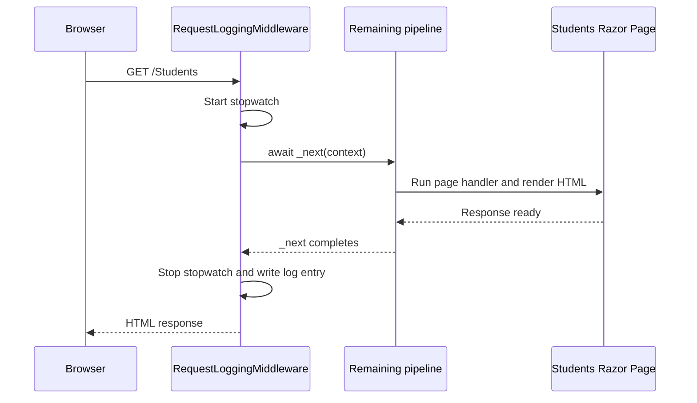

# Middleware in this project

Middleware is code that sits in the HTTP request pipeline. It can do work **before** a request reaches a Razor Page and/or **after** the page has produced a response.

The custom middleware in this project is:

```text
Middleware/RequestLoggingMiddleware.cs
```

It becomes active because `Program.cs` adds it to the pipeline:

```csharp
app.UseMiddleware<RequestLoggingMiddleware>();
```

The `Middleware` folder is only organization. `UseMiddleware(...)` is what registers the middleware.

## Where it runs

In `Program.cs`, the relevant order is:

```csharp
app.UseHttpsRedirection();
app.UseRouting();
app.UseMiddleware<RequestLoggingMiddleware>();
app.UseAuthorization();
app.MapRazorPages();
```


The request travels into the pipeline from left to right. After the endpoint finishes, control returns back through the middleware that awaited the next step.

## The dependencies

```csharp
public class RequestLoggingMiddleware
{
    private readonly RequestDelegate _next;
    private readonly ILogger<RequestLoggingMiddleware> _logger;
```

| Dependency | Plain meaning | What it does here |
| --- | --- | --- |
| `RequestDelegate _next` | A function representing the rest of the request pipeline. | Lets this middleware continue the request after starting its timer. |
| `ILogger<RequestLoggingMiddleware> _logger` | ASP.NET's logging service. | Writes the request details to the configured logs. |

ASP.NET provides both through the middleware constructor:

```csharp
public RequestLoggingMiddleware(
    RequestDelegate next,
    ILogger<RequestLoggingMiddleware> logger)
{
    _next = next;
    _logger = logger;
}
```

## The request handler

ASP.NET calls this method for each request that reaches this middleware:

```csharp
public async Task InvokeAsync(HttpContext context)
```

`HttpContext` contains information about the current request and response:

```csharp
context.Request.Method       // GET, POST, and so on
context.Request.Path         // for example, /Students
context.Response.StatusCode  // for example, 200 or 404
```

## Trace: `GET /Students`

```csharp
var stopwatch = Stopwatch.StartNew();
```

Start measuring how long the rest of the request takes.

```csharp
await _next(context);
```

Pass the request to the next middleware. Eventually, the Students Razor Page runs, loads data, renders HTML, and returns control here.

```csharp
finally
{
    stopwatch.Stop();

    _logger.LogInformation(
        "{Method} {Path} returned {StatusCode} in {ElapsedMilliseconds} ms",
        context.Request.Method,
        context.Request.Path,
        context.Response.StatusCode,
        stopwatch.ElapsedMilliseconds);
}
```

Stop the timer and write a log entry. A normal successful request could produce output like:

```text
GET /Students returned 200 in 18 ms
```



## Why `await _next(context)` matters

This line is what continues the request:

```csharp
await _next(context);
```

Without it, the request would stop inside `RequestLoggingMiddleware` and would never reach the Razor Page.

The common middleware pattern is:

```csharp
public async Task InvokeAsync(HttpContext context)
{
    // Work before the rest of the pipeline

    await _next(context);

    // Work after the rest of the pipeline
}
```

This middleware uses that pattern to measure and log request duration. The `finally` block ensures that it still attempts to log when code later in the pipeline throws an exception.
