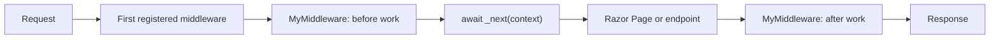

# Middleware template

Use this template for middleware that needs to run code before and/or after the rest of the ASP.NET request pipeline.

```csharp
public class MyMiddleware
{
    private readonly RequestDelegate _next;

    public MyMiddleware(RequestDelegate next)
    {
        _next = next;
    }

    public async Task InvokeAsync(HttpContext context)
    {
        // Work before the next middleware or endpoint.

        await _next(context);

        // Work after the next middleware or endpoint.
    }
}
```

## Register it in `Program.cs`

```csharp
app.UseMiddleware<MyMiddleware>();
```

Middleware order matters. A request reaches middleware in the order you register it.



## Template with a DI service

Add services the middleware needs to its constructor. ASP.NET supplies registered services through dependency injection.

```csharp
public class RequestLoggingMiddleware
{
    private readonly RequestDelegate _next;
    private readonly ILogger<RequestLoggingMiddleware> _logger;

    public RequestLoggingMiddleware(
        RequestDelegate next,
        ILogger<RequestLoggingMiddleware> logger)
    {
        _next = next;
        _logger = logger;
    }

    public async Task InvokeAsync(HttpContext context)
    {
        _logger.LogInformation("Request started: {Path}", context.Request.Path);

        await _next(context);

        _logger.LogInformation(
            "Request finished: {StatusCode}",
            context.Response.StatusCode);
    }
}
```

## What each part does

| Part | Purpose |
| --- | --- |
| `RequestDelegate _next` | Stores the rest of the request pipeline. |
| Constructor | Receives and stores dependencies when ASP.NET creates the middleware. |
| `InvokeAsync(HttpContext context)` | Runs once for each request that reaches this middleware. |
| `HttpContext` | Contains the current request and response. |
| `await _next(context)` | Continues the request to the next middleware/endpoint. |
| Code before `_next` | Runs on the way into the pipeline. |
| Code after `_next` | Runs on the way back out, after later middleware/endpoints finish. |

## Important rule

Usually call:

```csharp
await _next(context);
```

If you intentionally do **not** call it, your middleware ends the request itself. Later middleware and the Razor Page will not run.
