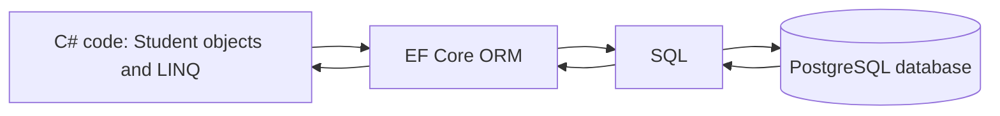
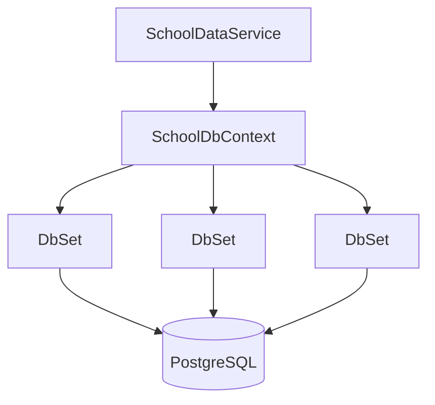
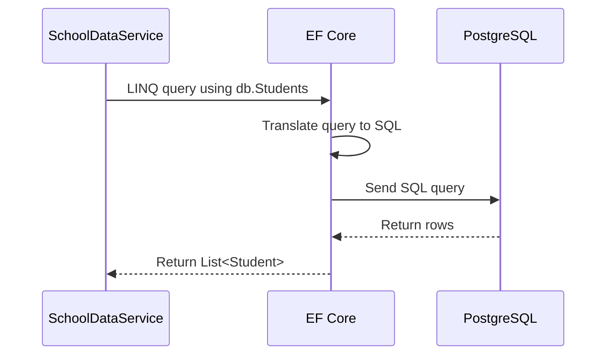
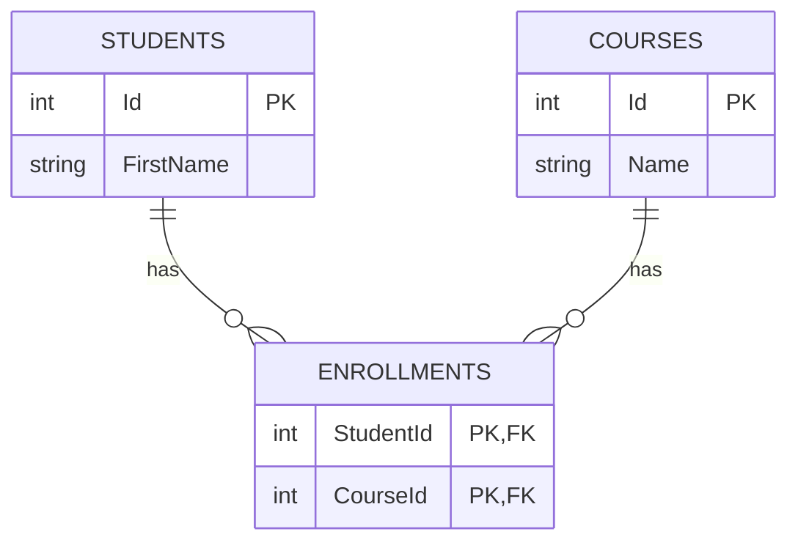

# Object-relational mapping (ORM)

## The simple idea

An **ORM** helps C# objects work with rows in a relational database.

In this project, the ORM is **Entity Framework Core (EF Core)** and the database provider is PostgreSQL.

```text
C# object world                    Relational database world
----------------                    -------------------------
Student object                      Students table row
Student.Id                          Id column
Student.FirstName                   FirstName column
List<Student>                       many rows from Students table
```



EF Core translates between these two worlds so application code can mostly work with C# classes and LINQ instead of writing SQL strings for every operation.

## The models become database entities

This project has model classes such as:

```csharp
public class Student
{
    public int Id { get; set; }
    public string FirstName { get; set; } = string.Empty;
    public string LastName { get; set; } = string.Empty;
    public string Email { get; set; } = string.Empty;
    public DateTime DateOfBirth { get; set; }
}
```

By convention, EF Core maps this approximately as:

| C# model | Database structure |
| --- | --- |
| `Student` class | `Students` table |
| One `Student` object | One row in that table |
| `Id` property | Primary-key column |
| `FirstName` property | `FirstName` column |
| `DateTime DateOfBirth` | Date/time column |

## `SchoolDbContext`: the ORM's database session

`SchoolDbContext` inherits from EF Core's `DbContext`:

```csharp
public class SchoolDbContext(...) : DbContext
```

Think of it as the object your application uses to communicate with the database during a request.

```csharp
public DbSet<Student> Students => Set<Student>();
public DbSet<Course> Courses => Set<Course>();
public DbSet<Enrollment> Enrollments => Set<Enrollment>();
```

`DbSet<T>` represents a set of database rows for one entity type:

```text
db.Students     → Students table
db.Courses      → Courses table
db.Enrollments  → Enrollments table
```



## Reading data: LINQ becomes SQL

This C# query:

```csharp
return db.Students
    .AsNoTracking()
    .Where(student => student.LastName == "Smith")
    .OrderBy(student => student.FirstName)
    .ToListAsync();
```

means:

```text
Find Students whose last name is Smith,
sort them by first name,
and return them as a List<Student>.
```

EF Core translates that LINQ query into SQL appropriate for PostgreSQL, runs it, then turns the returned rows into `Student` objects.



`ToListAsync()` is the point where the query is executed and actual objects are fetched.

## Saving data: objects become rows

To add a student:

```csharp
db.Students.Add(student);
await db.SaveChangesAsync();
```

The steps are:

```text
Create a Student object
→ Add tells EF Core that it should become a new row
→ SaveChangesAsync sends an INSERT command to PostgreSQL
→ database stores the row
```

To delete a student:

```csharp
db.Students.Remove(student);
await db.SaveChangesAsync();
```

EF Core sends the appropriate `DELETE` command when changes are saved.

## Relationships: `Enrollment` connects students and courses

This project models a many-to-many relationship with an `Enrollment` table.

```text
One student can take many courses.
One course can have many students.
Enrollment records each student/course pairing.
```



`SchoolDbContext.OnModelCreating` configures the database rules:

```csharp
modelBuilder.Entity<Enrollment>()
    .HasKey(enrollment => new
    {
        enrollment.StudentId,
        enrollment.CourseId
    });
```

That makes the combination of `StudentId` and `CourseId` the key, so a student cannot be enrolled in the same course twice.

## Code-first and migrations

This project describes its database shape in C#:

```text
Models: Student, Course, Enrollment
DbContext: DbSet properties and relationship rules
```

That is the **code-first** approach.

When you change the database shape—for example, add a property that needs a new column—the usual EF Core process is:

```text
Change C# model/configuration
→ create a migration
→ apply the migration to PostgreSQL
```

## What an ORM does not mean

An ORM does not remove the database or make database rules unimportant.

```text
EF Core still sends SQL to PostgreSQL.
PostgreSQL still enforces keys, indexes, and constraints.
You still need to think about query efficiency and database design.
```

The ORM's value is that it maps those database operations to C# objects, LINQ queries, and methods such as `Add`, `Remove`, and `SaveChangesAsync`.
