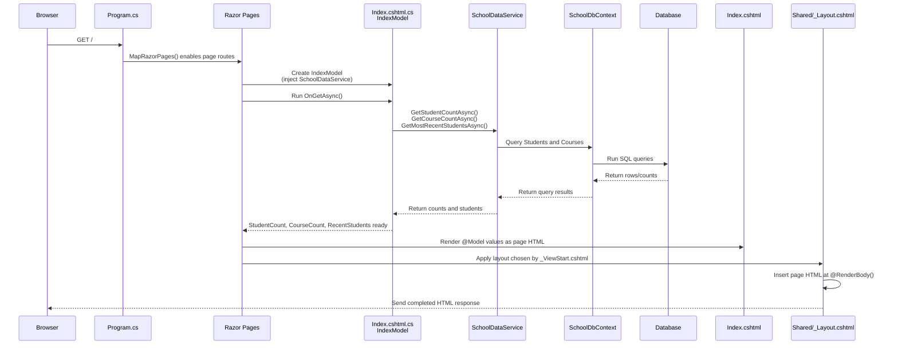
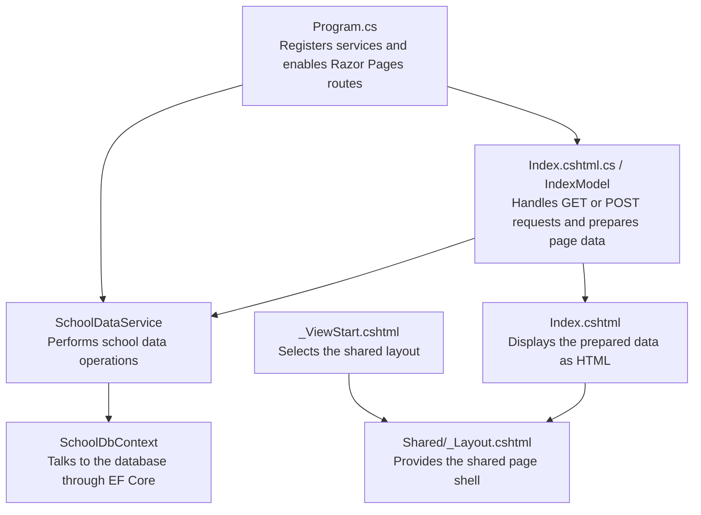

# Razor Pages orchestration

This diagram shows what happens when a browser requests the dashboard route (`/`).

## Responsibilities

`Index.cshtml.cs` does not normally query the database directly. It asks `SchoolDataService`, then makes the resulting values available to `Index.cshtml` through `@Model`.
