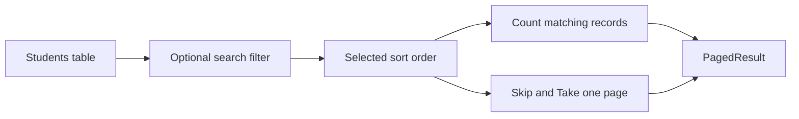
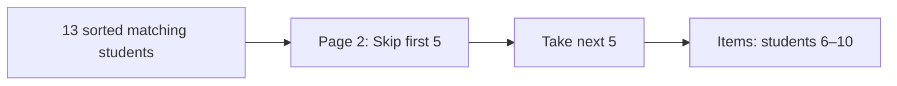
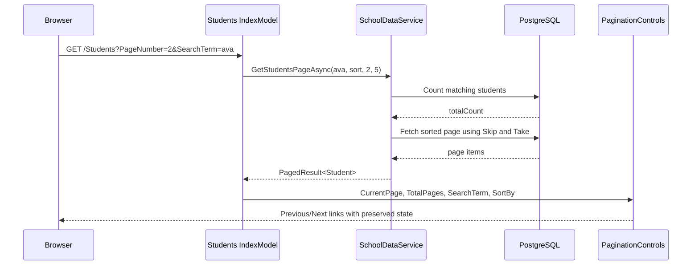

# Pagination in this Razor Pages project

Pagination means showing a large result set in small pieces called **pages**.

Instead of loading every student at once, this project shows five students at a time.

```text
23 matching students, page size 5

Page 1 → students 1–5
Page 2 → students 6–10
Page 3 → students 11–15
Page 4 → students 16–20
Page 5 → students 21–23
```

## The request URL holds the current page

Example:

```text
/Students?PageNumber=2&SearchTerm=ava&SortBy=FirstName
```

| Query-string value | Meaning |
| --- | --- |
| `PageNumber=2` | Show page 2. |
| `SearchTerm=ava` | Only include names matching `ava`. |
| `SortBy=FirstName` | Sort the matches by first name. |

Keeping this state in the URL means the page can be refreshed, bookmarked, shared, and revisited with the same search, sort, and page.

## 1. Bind the page number in the Page Model

`Pages/Students/Index.cshtml.cs` receives `PageNumber` from the GET URL:

```csharp
[BindProperty(SupportsGet = true)]
public int PageNumber { get; set; } = 1;
```

```text
/Students?PageNumber=2
→ PageNumber becomes 2

No PageNumber in the URL
→ default value is 1
```

The Page Model calls the service with all the current state:

```csharp
PagedResult<Student> result = await schoolData.GetStudentsPageAsync(
    SearchTerm,
    SortBy,
    PageNumber,
    pageSize: 5);
```

## 2. Build the filtered and sorted query

Inside `SchoolDataService`, the method starts an adjustable database query:

```csharp
IQueryable<Student> students = db.Students.AsNoTracking();
```

It adds search filtering only when there is a search term, then chooses an ordering based on `SortBy`.



The query is not run when `Where` or `OrderBy` is added. EF Core runs it later at `CountAsync()` and `ToListAsync()`.

## 3. Count all matching records

```csharp
int totalCount = await students.CountAsync();
```

This tells the page how many matching students exist in total.

For example:

```text
Search “ava” finds 13 students
→ totalCount = 13
```

The count is needed to calculate the total number of pages.

## 4. Calculate safe page values

```csharp
int safePageSize = Math.Max(pageSize, 1);
int totalPages = Math.Max(
    1,
    (int)Math.Ceiling(totalCount / (double)safePageSize));
int currentPage = Math.Clamp(pageNumber, 1, totalPages);
```

These lines protect against invalid query-string values.

| Situation | Result |
| --- | --- |
| `pageSize` is `0` | Use `1` instead. |
| No records match | Keep `totalPages` at `1`, not `0`. |
| URL asks for page `99`, but there are only 3 pages | Use page `3`. |
| URL asks for page `0` | Use page `1`. |

For 13 matching students with a page size of 5:

```text
13 ÷ 5 = 2.6
Ceiling(2.6) = 3
→ totalPages = 3
```

## 5. Fetch only the current page

```csharp
List<Student> items = await orderedStudents
    .Skip((currentPage - 1) * safePageSize)
    .Take(safePageSize)
    .ToListAsync();
```

`Skip` ignores earlier records. `Take` limits the result.

For page 2 and a page size of 5:

```text
Skip((2 - 1) × 5)
→ Skip(5)

Take(5)
→ return records 6–10
```



This is why pagination is useful: the database returns only the records the user currently needs to see.

## 6. Return a `PagedResult<T>`

The service returns one object containing both the page items and pagination information:

```csharp
return new PagedResult<Student>
{
    Items = items,
    PageNumber = currentPage,
    TotalPages = totalPages,
    TotalCount = totalCount
};
```

| Property | Meaning |
| --- | --- |
| `Items` | The students for the current page only. |
| `PageNumber` | The valid page currently being displayed. |
| `TotalPages` | Number of pages available. |
| `TotalCount` | Number of matching students across every page. |

The Page Model copies these into properties that `Index.cshtml` can display.

## 7. Render Previous and Next links

`Pages/Students/Index.cshtml` gives the current values to `PaginationControls`:

```razor
<component type="typeof(PaginationControls)" render-mode="Static"
           param-PagePath='@("/Students")'
           param-CurrentPage="@Model.PageNumber"
           param-TotalPages="@Model.TotalPages"
           param-SearchTerm="@Model.SearchTerm"
           param-SortBy="@Model.SortBy" />
```

The component creates links such as:

```text
/Students?PageNumber=1&SearchTerm=ava&SortBy=FirstName
/Students?PageNumber=3&SearchTerm=ava&SortBy=FirstName
```

Notice that these links preserve the current search and sort values. Going to another page should not lose the user’s filter or ordering.

## Full request flow



## Reusable checklist

```text
1. Put PageNumber in the GET query string.
2. Bind it with [BindProperty(SupportsGet = true)].
3. Build one filtered and sorted IQueryable<T>.
4. Count the filtered results.
5. Clamp the requested page to a valid page number.
6. Use Skip and Take to fetch only that page.
7. Return items plus page metadata in a PagedResult<T>.
8. Make navigation links preserve search, sorting, and other filters.
```
