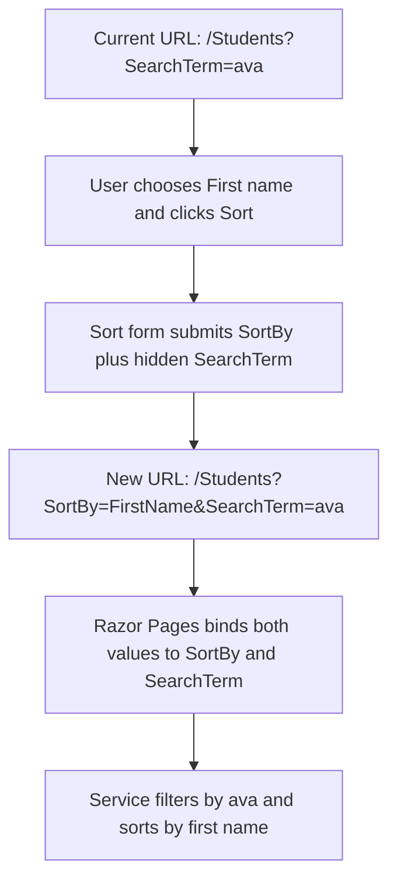

# Keeping search and sort values in Razor Pages GET forms

## The problem

The Students page has two separate forms:

```text
Search form → sends SearchTerm
Sort form   → sends SortBy
```

When a browser submits a form with `method="get"`, it only puts inputs from **that one form** into the URL.

So, without extra work:

```text
Current page: /Students?SearchTerm=ava

User chooses “First name” and submits the sort form
→ /Students?SortBy=FirstName
→ SearchTerm=ava is lost
```

## The solution: hidden inputs

Put the other value in a hidden input inside each form.

### Search form keeps the current sort choice

```html
<form method="get" class="student-search">
    <input type="hidden" asp-for="SortBy" />
    <input asp-for="SearchTerm" type="search" />
    <button type="submit">Search</button>
</form>
```

If `SortBy` is `FirstName`, Razor generates an invisible input similar to:

```html
<input type="hidden" name="SortBy" value="FirstName" />
```

Searching for `ava` then creates:

```text
/Students?SortBy=FirstName&SearchTerm=ava
```

### Sort form keeps the current search term

```html
<form method="get" class="student-sort">
    <input type="hidden" asp-for="SearchTerm" />
    <select asp-for="SortBy">
        <option value="FirstName">First name</option>
    </select>
    <button type="submit">Sort</button>
</form>
```

If `SearchTerm` is `ava`, Razor generates an invisible input similar to:

```html
<input type="hidden" name="SearchTerm" value="ava" />
```

Sorting by first name then creates:

```text
/Students?SortBy=FirstName&SearchTerm=ava
```

## Request flow



## Why `asp-for` is used

```html
<input type="hidden" asp-for="SearchTerm" />
```

`asp-for` connects the hidden input to this Page Model property:

```csharp
public string? SearchTerm { get; set; }
```

It generates the correct input name and current value. That name is what lets Razor Pages bind the query-string value back into `SearchTerm` on the next GET request.

## General rule

```text
Two or more separate GET forms share page state?
→ Each form must include its own input for every value that should survive submission.

The user should not edit a value in this form?
→ Include it as <input type="hidden" ...>.
```

For this page:

```text
Search form submits SearchTerm and preserves SortBy.
Sort form submits SortBy and preserves SearchTerm.
```
