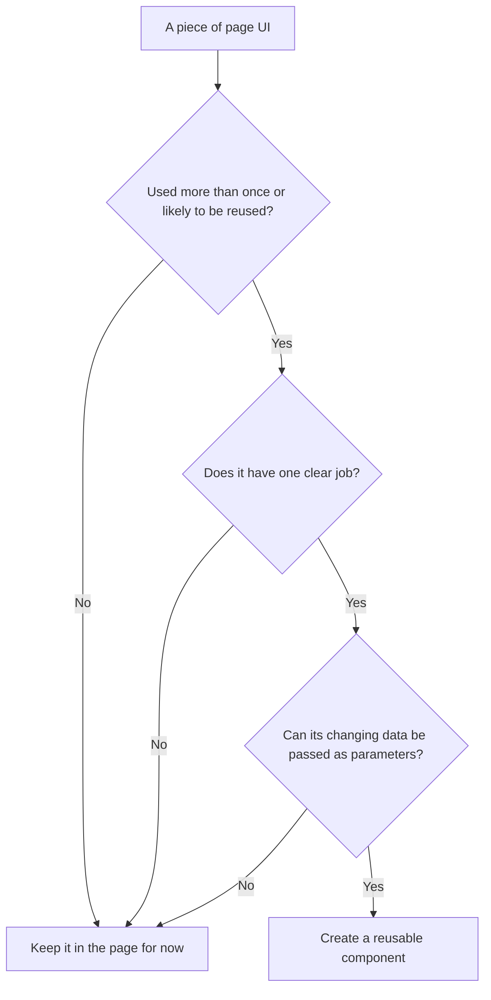
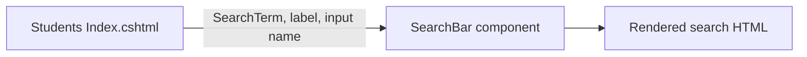

# Making reusable Razor components

A reusable component is a small UI piece that has one clear job and can receive different data from different pages.

Examples in this project:

```text
SearchBar           → displays a search input, button, and optional Clear link
SortDropdown        → displays a sort selector
PaginationControls  → displays Previous and Next links
Alert               → displays a message
EmptyState          → displays an empty-results message
StudentCard         → displays one student summary
```

## When should something become a component?

Make a component when all of these are mostly true:

```text
The UI has one clear responsibility.
It is used in more than one place, or is likely to be reused.
Its changing values can be passed in as parameters.
It does not need to know the whole Page Model.
```



Do not make a component only because some HTML is several lines long. A component should make the page easier to understand, not hide page-specific logic.

## Step 1: Create a `.razor` file

Components in this project are stored in:

```text
Components/
```

For example:

```text
Components/SearchBar.razor
```

Its markup is the reusable UI:

```razor
<div class="search-bar">
    <label for="@InputId">@Label</label>
    <input id="@InputId" name="@Name" type="search" value="@Value" />
    <button type="submit">Search</button>
</div>
```

The component does not hard-code a page-specific property like `Model.SearchTerm`. It receives values from whichever page uses it.

## Step 2: Define parameters

Parameters are the component's inputs.

```razor
@code {
    [Parameter, EditorRequired] public string InputId { get; set; } = string.Empty;
    [Parameter, EditorRequired] public string Name { get; set; } = string.Empty;
    [Parameter, EditorRequired] public string Label { get; set; } = string.Empty;
    [Parameter] public string? Value { get; set; }
}
```

| Part | Meaning |
| --- | --- |
| `[Parameter]` | The parent page/component may provide this value. |
| `EditorRequired` | Warns the developer if they forget an important parameter. |
| `string?` | The value is allowed to be `null`. |
| `= string.Empty` | Gives a non-null string property a safe initial value. |

Think of parameters as a component's public inputs:



## Step 3: Use the component from a Razor Page

This project uses Razor Pages and renders its components statically:

```razor
<component type="typeof(SearchBar)" render-mode="Static"
           param-InputId='@("student-search-input")'
           param-Name='@("SearchTerm")'
           param-Label='@("Search students")'
           param-Placeholder='@("Search by first or last name")'
           param-Value="@Model.SearchTerm"
           param-ClearUrl="@Model.ClearSearchUrl" />
```

Read this as:

```text
Render SearchBar
with these parameter values
as ordinary HTML in this Razor Page response
```

The `param-` prefix supplies a value to a `[Parameter]` property:

```text
param-Value="@Model.SearchTerm"
→ SearchBar.Value receives the current search term
```

## Step 4: Keep responsibilities separate

For the Students page, the work is divided like this:

| Part | Responsibility |
| --- | --- |
| `IndexModel` | Loads students, search/sort/page state, and creates URLs. |
| `SchoolDataService` | Queries the database. |
| `SearchBar` | Renders search controls from supplied values. |
| `PaginationControls` | Renders Previous/Next links from supplied page state. |

```text
Page Model prepares data
→ component receives only the values it needs
→ component renders its focused HTML
```

For example, `PaginationControls` receives:

```text
CurrentPage
TotalPages
SearchTerm
SortBy
```

It does not query `SchoolDbContext` itself. Its job is only to build the navigation UI.

## Component checklist

Before creating a component, check:

```text
[ ] Can I name its one responsibility in one short sentence?
[ ] Are its changing values explicit parameters?
[ ] Does it avoid depending on a whole Page Model?
[ ] Does it avoid database/page-handler logic?
[ ] Will it reduce repeated UI or make a complex page easier to read?
[ ] Are important parameters marked EditorRequired?
```

## A small reusable example

An alert component can accept only one changing value: the message.

```razor
<div class="success-alert" role="alert">@Message</div>

@code {
    [Parameter, EditorRequired]
    public string Message { get; set; } = string.Empty;
}
```

A page can use it with different messages:

```razor
<component type="typeof(Alert)" render-mode="Static"
           param-Message="@successMessage" />
```

The component owns the common alert markup. The page owns the specific message and the decision about whether the alert should appear.
