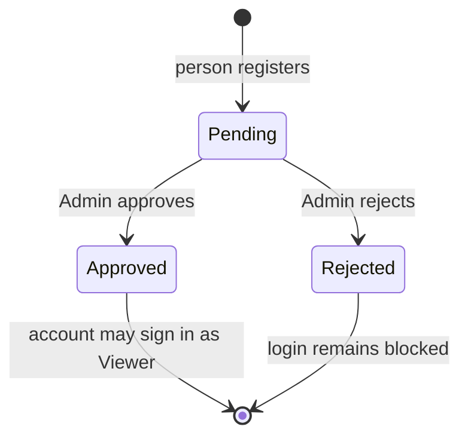
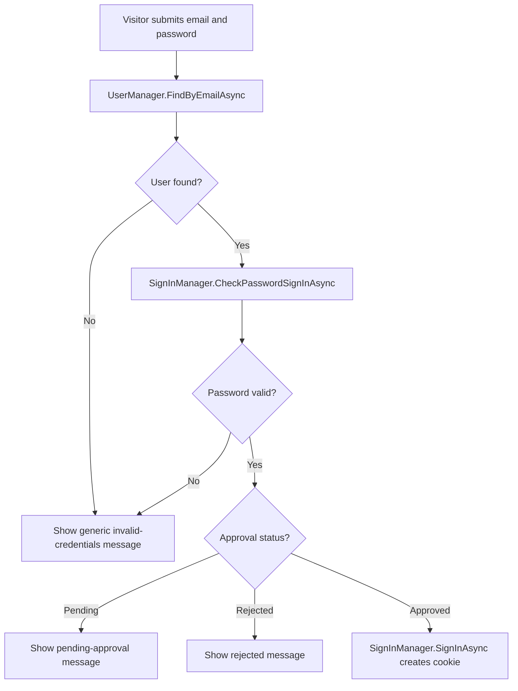
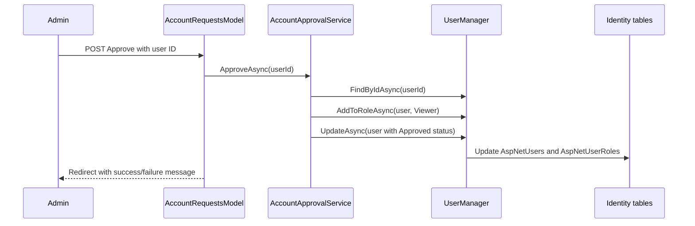

# Account approval flow

This application lets people request an account, but it does not let a new account sign in until an administrator approves it.

```text
Anonymous visitor registers
→ account is created as Pending
→ administrator approves or rejects it
→ only an Approved account can sign in
```

## The three approval states

`Models/AccountApprovalStatus.cs` defines the possible states:

```csharp
public enum AccountApprovalStatus
{
    Pending,
    Approved,
    Rejected
}
```

`ApplicationUser` stores one of these values for every Identity account:

```csharp
public AccountApprovalStatus ApprovalStatus { get; set; }
    = AccountApprovalStatus.Pending;
```



`Pending` is the safe default. A new person does not automatically receive access merely because they created an account.

## Main pieces and responsibilities

| File/class | Responsibility |
| --- | --- |
| `AccountApprovalStatus` | Names the three account states. |
| `ApplicationUser` | Stores each user's approval status in Identity data. |
| `RegisterModel` | Creates a new pending account. |
| `LoginModel` | Verifies credentials, then blocks pending/rejected accounts before creating a login cookie. |
| `AccountApprovalService` | Finds pending accounts and approves/rejects them. |
| `AccountRequestsModel` | Admin-only Page Model that uses the approval service. |
| `UserManager<ApplicationUser>` | Identity service for creating, finding, updating users, and assigning roles. |

`Program.cs` registers the approval service as scoped:

```csharp
builder.Services.AddScoped<AccountApprovalService>();
```

## 1. An anonymous visitor requests access

`/Account/Register` is explicitly available to anonymous visitors:

```csharp
options.Conventions.AllowAnonymousToPage("/Account/Register");
```

When the registration form is submitted, `RegisterModel.OnPostAsync()` first validates email, password, and confirmation.

Then it creates the user:

```csharp
var user = new ApplicationUser
{
    UserName = Input.Email,
    Email = Input.Email,
    ApprovalStatus = AccountApprovalStatus.Pending
};

var result = await userManager.CreateAsync(user, Input.Password);
```

`UserManager.CreateAsync` hashes the password and stores the account in `AspNetUsers`. The plain password is not stored.

On success, the visitor is redirected to Login with a message:

```text
“Your access request was sent. Sign in later to check whether an administrator has approved it.”
```

At this point:

```text
The user exists in AspNetUsers.
The user has ApprovalStatus = Pending.
The user has no Viewer role yet.
The user is not signed in.
```

## 2. Login verifies the password but checks approval before signing in

The Login Page Model receives both Identity services:

```csharp
public class LoginModel(
    SignInManager<ApplicationUser> signInManager,
    UserManager<ApplicationUser> userManager) : PageModel
```

The login flow intentionally has two stages:



The password check is:

```csharp
var passwordResult = await signInManager.CheckPasswordSignInAsync(
    user,
    Input.Password,
    lockoutOnFailure: false);
```

`CheckPasswordSignInAsync` checks the password **without creating a cookie**. That is why a pending or rejected account cannot sign in merely by having the correct password.

Only after the approval checks pass does the code sign the user in:

```csharp
await signInManager.SignInAsync(user, Input.RememberMe);
```

## 3. An Admin reviews pending requests

The review page is protected by the existing policy:

```csharp
[Authorize(Policy = "AdminOnly")]
public class AccountRequestsModel(...) : PageModel
```

Only a user in the `Admin` role can open `/Admin/AccountRequests` or submit its approve/reject forms.

The page loads pending accounts through `AccountApprovalService`:

```csharp
public async Task<List<ApplicationUser>> GetPendingAccountsAsync()
{
    return await userManager.Users
        .Where(user => user.ApprovalStatus == AccountApprovalStatus.Pending)
        .OrderBy(user => user.Email)
        .ToListAsync();
}
```

The page shows each pending account with two POST forms:

```text
Approve → OnPostApproveAsync(id)
Reject  → OnPostRejectAsync(id)
```



## 4. Approving an account

`AccountApprovalService.ApproveAsync` first checks that the account exists and is still pending:

```csharp
if (user is null || user.ApprovalStatus != AccountApprovalStatus.Pending)
{
    return false;
}
```

Then it ensures the account has the Viewer role:

```csharp
if (!await userManager.IsInRoleAsync(user, "Viewer"))
{
    await userManager.AddToRoleAsync(user, "Viewer");
}
```

Finally, it changes the approval status and saves the user:

```csharp
user.ApprovalStatus = AccountApprovalStatus.Approved;
await userManager.UpdateAsync(user);
```

The approved account now has:

```text
ApprovalStatus = Approved
Role = Viewer
```

It can sign in, see lists and details, but cannot access Admin-only management actions.

## 5. Rejecting an account

`RejectAsync` also only works for an existing pending account:

```csharp
user.ApprovalStatus = AccountApprovalStatus.Rejected;
await userManager.UpdateAsync(user);
```

The account remains in `AspNetUsers`, but Login displays a rejection message and does not create an authentication cookie.

## Why the checks exist in more than one place

There are separate checks for separate responsibilities:

| Check | Why it exists |
| --- | --- |
| Registration sets `Pending` | New accounts start with no access. |
| Login checks approval status | Pending/rejected users cannot get a cookie. |
| Account Requests page uses `AdminOnly` | Only administrators can decide requests. |
| Service checks status is still `Pending` | Prevents a duplicate or stale approve/reject request from changing an already-decided account. |
| Approval adds `Viewer` role | Approved users receive the intended read-only role. |

## Full mental model

```text
Register
→ create user with Pending status
→ no login cookie

Admin approves
→ add Viewer role
→ change status to Approved

Approved user logs in
→ password verified
→ approval status accepted
→ authentication cookie created
→ Viewer can access signed-in read-only pages
```

The seeded administrator is different: it is created during startup with `ApprovalStatus = Approved` and the `Admin` role, so it can manage approval requests immediately.
