# Step 1 : Add ASP.NET Core Identity configuration.

### 1. You created an account model

```cs
public class ApplicationUser : IdentityUser
{
}
```

ApplicationUser represents someone who can sign in.
It inherits from:

```
IdentityUser
```

so it already gets Identity’s built-in account fields, such as:

```
Id
UserName
Email
PasswordHash
SecurityStamp
```

The class is empty because you have no custom account fields yet. Later, you could add something app-specific:

```cs
public string DisplayName { get; set; } = string.Empty;
```
Important distinction:

```
Student         → a school record
ApplicationUser → a login account
```

They are separate concepts. A future account might be an administrator who is not a student.
### 2. You changed the database context’s base class

Before:
```cs
public class SchoolDbContext(...) : DbContext
```
Now:
```cs
public class SchoolDbContext(...)
    : IdentityDbContext<ApplicationUser>(options)
```
`IdentityDbContext<ApplicationUser>` is a special EF Core context that already knows how to model Identity data.

So your context now understands:
Your app’s entities:

```
Students, Courses, Enrollments
```

Identity entities:

```
ApplicationUsers, Roles, UserRoles,

Password/claim/token-related Identity tables
```

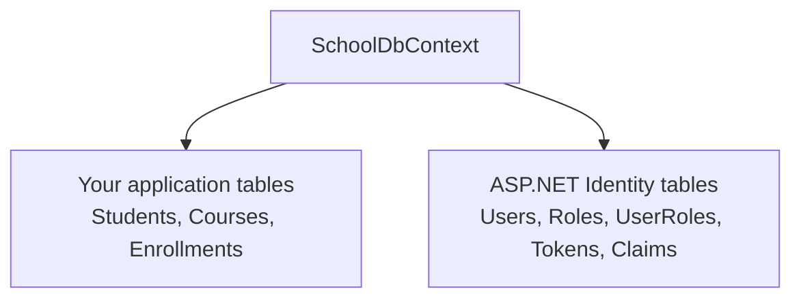
    
This line is especially important:

```cs
base.OnModelCreating(modelBuilder);
```

It lets IdentityDbContext configure all its Identity database rules before your context adds the course/enrollment rules.

### 3. You registered Identity services

In Program.cs:

```cs
builder.Services.AddIdentity<ApplicationUser, IdentityRole>(options =>
{
    options.SignIn.RequireConfirmedAccount = false;
})
.AddEntityFrameworkStores<SchoolDbContext>()
.AddDefaultTokenProviders();
```
Read it piece by piece.

```cs
AddIdentity<ApplicationUser, IdentityRole>
```

ApplicationUser → account type
IdentityRole    → role type, such as Admin or Viewer

This registers Identity services such as user management, password hashing, sign-in support, roles, and cookie-related services.

```
.AddEntityFrameworkStores<SchoolDbContext>()
```

This tells Identity:

***“Store users and roles through SchoolDbContext in PostgreSQL.”***

```
UserManager / RoleManager
→ Identity EF Core store
→ SchoolDbContext
→ PostgreSQL
```

```cs
.AddDefaultTokenProviders()
```
Registers token tools for features such as:

```
password reset tokens
email confirmation tokens
two-factor authentication tokens
RequireConfirmedAccount = false
options.SignIn.RequireConfirmedAccount = false;
```
means users will not need to confirm an email address before they can sign in. That is often convenient while learning/developing.

### 4. You configured future login routes

```cs
builder.Services.ConfigureApplicationCookie(options =>
{
    options.LoginPath = "/Account/Login";
    options.AccessDeniedPath = "/Account/AccessDenied";
});
```

This says:

Unauthenticated user reaches protected page
→` redirect to /Account/Login`

Signed-in user lacks required permission
→` redirect to /Account/AccessDenied`


# Step 2 : Create and apply the database migration.

This step makes the Identity setup real in PostgreSQL.

  

Before the migration:

  

```text

C# code knew about ApplicationUser and Identity.

PostgreSQL did not yet have Identity tables.

```

  

After applying the migration:

  

```text

C# code knows about Identity.

PostgreSQL now has Identity tables too.

```

  

## The two separate steps

  

Creating a migration and applying a migration are different operations.

  

```text

dotnet ef migrations add AddIdentity


→ EF Core compares the current C# model with the previous EF migration snapshot.

→ EF Core creates migration code describing the needed database changes.

  

dotnet ef database update

→ EF Core checks __EFMigrationsHistory in PostgreSQL.

→ It sees AddIdentity was not applied.

→ It runs that migration's SQL against PostgreSQL.

→ It records the migration as applied.

```

  

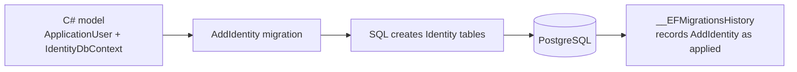

  

## Identity tables created

  

| Table | Purpose |
| --- | --- |
| `AspNetUsers` | Stores login accounts, email, username, password hash, and related account values. |
| `AspNetRoles` | Stores roles such as `Admin` or `Viewer`. |
| `AspNetUserRoles` | Connects users to roles. |
| `AspNetUserClaims` and `AspNetRoleClaims` | Stores extra permission and identity information. |
| `AspNetUserLogins` | Stores external-login information, if the app uses it. |
| `AspNetUserTokens` | Stores Identity token-related information. |

  

## Important result

  

```text

The tables now exist,

```

# Step 3 : Add authentication middleware

Identity services and Identity database tables are not enough on their own. The request pipeline also needs middleware that reads a login cookie for every incoming request.

  

This line enables that step:

  

```csharp

app.UseAuthentication();

```

  

In this project it is correctly placed before authorization:

  

```csharp

app.UseRouting();

app.UseMiddleware<RequestLoggingMiddleware>();

app.UseAuthentication();

app.UseAuthorization();

app.MapRazorPages();

```

  

```text

Authentication answers: “Who is this request from?”

Authorization answers:  “Is this identified user allowed to do this?”

```

  

Authorization must come after authentication because it needs to know who the user is first.

  

## What happens for a signed-in user

  

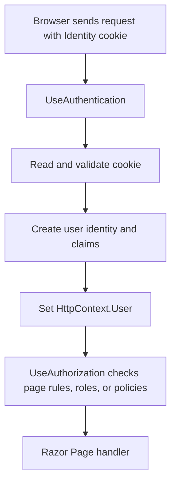

  

Step by step:

  

```text

1. The browser sends a request, including its authentication cookie.

2. UseAuthentication uses the configured Identity cookie handler.

3. It reads and validates the cookie.

4. It builds the signed-in user's identity and claims.

5. It stores that identity in HttpContext.User for this request.

6. UseAuthorization can now inspect that user before the Razor Page runs.

```

  

## `HttpContext.User`

  

`HttpContext.User` holds a `ClaimsPrincipal`: the current request's user identity and related claims.

  

In a Razor Page Model, `User` is available through `PageModel`, so later code can ask:

  

```csharp

User.Identity?.Name

```

  

For an authenticated user, this can return their username. It can also be anonymous or have no name when no valid login cookie exists.

  

Role checks can ask, for example:

  

```csharp

User.IsInRole("Admin")

```

  

## What happens when no user is logged in?

  

```text

No cookie, or an invalid cookie

→ UseAuthentication leaves the request as anonymous

→ HttpContext.User has no authenticated identity

→ the page can still run if it allows anonymous users

```

  

`UseAuthentication()` does not create a login page and does not itself protect pages. A later `[Authorize]` rule or authorization policy decides whether an anonymous user may access an endpoint.

  

## Current state of this project

  

```text

Identity services are registered.

Identity tables exist in PostgreSQL.

UseAuthentication reads future login cookies.

No login page exists yet.

No user account exists yet.

No page requires authentication yet.

```

  

So this step prepares the request-pipeline behavior. It will become visible after later steps create users, sign them in, and protect pages.

# Step 4 : Build login and logout pages

This step adds Razor Pages that start and end an authenticated session.

  

```text

Login  → verify credentials and create an authentication cookie

Logout → remove the authentication cookie

```

  

The earlier Identity setup already registered Identity services, created Identity database tables, and added `UseAuthentication()` to the request pipeline. These pages now use those pieces.

  

## Login page files

  

```text

Pages/Account/Login.cshtml     → the HTML login form

Pages/Account/Login.cshtml.cs  → the login request handling

```

  

## The login form

  

The form sends these values with a POST request:

  

```text

Email

Password

Remember me

Return URL, if one exists

```

  

```html

<form method="post" class="auth-form">

    <input type="hidden" asp-for="ReturnUrl" />

    <input asp-for="Input.Email" />

    <input asp-for="Input.Password" />

    <input asp-for="Input.RememberMe" />

    <button type="submit">Sign in</button>

</form>

```

  

`asp-for` connects each input to the Login Page Model's `Input` property.

  

## The Login Page Model receives `SignInManager`

  

```csharp

public class LoginModel(SignInManager<ApplicationUser> signInManager)

    : PageModel

```

  

`SignInManager<ApplicationUser>` is provided through dependency injection. `AddIdentity<ApplicationUser, IdentityRole>(...)` registered this Identity service earlier.

  

Its job includes safely handling sign-in operations:

  

```text

find the configured Identity user

verify the submitted password against its stored password hash

create or remove authentication cookies

```

  

The application never reads, compares, or stores a plain-text password itself.

  

## Login request flow

  

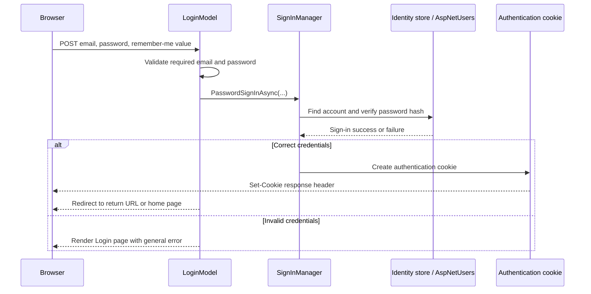

  

The main call is:

  

```csharp

var result = await signInManager.PasswordSignInAsync(

    Input.Email,

    Input.Password,

    Input.RememberMe,

    lockoutOnFailure: false);

```

  

| Argument | Meaning |
| --- | --- |
| `Input.Email` | The Identity username for this project. The planned seeded users use their email as their username. |
| `Input.Password` | The password the user submitted. Identity verifies it against a secure stored hash. |
| `Input.RememberMe` | Chooses whether the login cookie should persist on the device. |
| `lockoutOnFailure: false` | Failed attempts do not currently contribute to account lockout. |

  

When the result succeeds:

  

```csharp

return LocalRedirect(ReturnUrl ?? Url.Content("~/"));

```

  

`ReturnUrl` is where the user originally wanted to go. `LocalRedirect` only permits a local URL in this application, which helps prevent redirects to an untrusted external site.

  

## Later requests after login

  

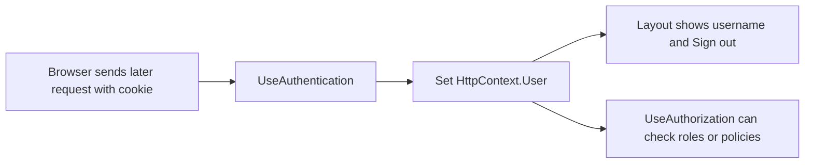

  

`UseAuthentication()` reads the cookie on each later request. The shared layout can then use:

  

```razor

@if (User.Identity?.IsAuthenticated == true)

{

    <span>@User.Identity.Name</span>

}

```

  

That produces two navigation states:

  

```text

Anonymous user  → Sign in link

Signed-in user  → username and Sign out button

```

  

## Logout

  

The layout uses a POST form:

  

```razor

<form method="post" asp-page="/Account/Logout">

    <button type="submit">Sign out</button>

</form>

```

  

The Logout Page Model runs:

  

```csharp

public async Task<IActionResult> OnPostAsync()

{

    await signInManager.SignOutAsync();

    return RedirectToPage("/Index");

}

```

  

`SignOutAsync()` removes the authentication cookie. On the next request, `UseAuthentication()` finds no valid login cookie, so the browser is anonymous again.

  

```text

Signed-in browser

→ POST /Account/Logout

→ SignOutAsync removes cookie

→ redirect to dashboard

→ later request has no valid authentication cookie

→ User.Identity.IsAuthenticated is false

```

  

The `OnGet()` handler on the logout page only redirects home:

  

```csharp

public IActionResult OnGet()

{

    return RedirectToPage("/Index");

}

```

  

This prevents a normal GET link/visit from signing someone out. Logout changes session state, so using POST is the appropriate HTTP action.

# Step5 : Seeding initial Identity data

Seeding means creating required initial data automatically. In this project, the seeder creates:

  

```text

Admin role

Viewer role

Initial administrator account, when credentials are configured

Admin role assignment for that account

```

  

The code is in `Data/IdentityDataSeeder.cs`.

  

## When it runs

  

`Program.cs` runs the seeder after building the application but before accepting web requests:

  

```csharp

var app = builder.Build();

  

using (var scope = app.Services.CreateScope())

{

    await IdentityDataSeeder.SeedAsync(scope.ServiceProvider);

}

```

  

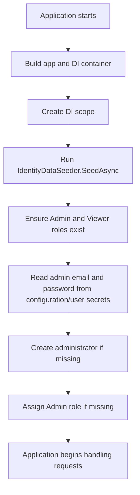

  

## Services used by the seeder

  

```csharp

var roleManager = serviceProvider.GetRequiredService<RoleManager<IdentityRole>>();

var userManager = serviceProvider.GetRequiredService<UserManager<ApplicationUser>>();

var configuration = serviceProvider.GetRequiredService<IConfiguration>();

```

  

| Service | Job |
| --- | --- |
| `RoleManager<IdentityRole>` | Finds and creates role records such as `Admin` and `Viewer`. |
| `UserManager<ApplicationUser>` | Finds and creates user accounts, hashes passwords, and assigns roles. |
| `IConfiguration` | Reads configured seed values, including user secrets in development. |
| `ILoggerFactory` | Creates a logger so the seeder can report what it created or why it skipped the admin account. |

  

The seeder is a static method started manually during app startup, so it gets its needed services from the supplied `IServiceProvider`. Page Models instead normally receive services through constructor injection.

  

## 1. Ensure the roles exist

  

```csharp

private static readonly string[] RoleNames = ["Admin", "Viewer"];

  

foreach (var roleName in RoleNames)

{

    if (!await roleManager.RoleExistsAsync(roleName))

    {

        var roleResult = await roleManager.CreateAsync(new IdentityRole(roleName));

        EnsureSucceeded(roleResult, $"create the {roleName} role");

    }

}

```

  

For each role:

  

```text

Role already exists

→ do nothing

  

Role does not exist

→ create it in AspNetRoles

```

  

## 2. Read the administrator credentials safely

  

```csharp

var adminEmail = configuration["IdentitySeed:AdminEmail"];

var adminPassword = configuration["IdentitySeed:AdminPassword"];

```

  

The values are expected under these configuration keys:

  

```text

IdentitySeed:AdminEmail

IdentitySeed:AdminPassword

```

  

They belong in user secrets during local development, not in C# code or a Git-tracked settings file.

  

If either value is missing:

  

```csharp

if (string.IsNullOrWhiteSpace(adminEmail) || string.IsNullOrWhiteSpace(adminPassword))

{

    logger.LogWarning(...);

    return;

}

```

  

The roles can still be created, but the administrator account is skipped.

  

## 3. Create the administrator only if needed

  

```csharp

var administrator = await userManager.FindByEmailAsync(adminEmail);

  

if (administrator is null)

{

    administrator = new ApplicationUser

    {

        UserName = adminEmail,

        Email = adminEmail,

        EmailConfirmed = true

    };

  

    var userResult = await userManager.CreateAsync(administrator, adminPassword);

    EnsureSucceeded(userResult, "create the initial administrator account");

}

```

  

`UserManager.CreateAsync(administrator, adminPassword)` receives the plain password only temporarily. Identity hashes it securely and stores the resulting hash in `AspNetUsers`; it does not store the original password.

  

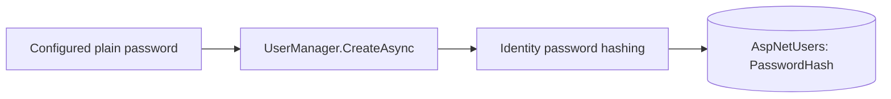

  

## 4. Assign the Admin role only if needed

  

```csharp

if (!await userManager.IsInRoleAsync(administrator, "Admin"))

{

    var roleResult = await userManager.AddToRoleAsync(administrator, "Admin");

    EnsureSucceeded(roleResult, "assign the Admin role to the initial administrator account");

}

```

  

This creates the user/role relationship in the Identity database tables.

  

```text

ApplicationUser

→ Admin role

→ AspNetUserRoles record

```

  

## Why it is safe to run at every startup

  

The seeder checks before creating anything:

  

| Data             | Check                                   |
| ---------------- | --------------------------------------- |
| Role             | `RoleExistsAsync(roleName)`             |
| Administrator    | `FindByEmailAsync(adminEmail)`          |
| Admin assignment | `IsInRoleAsync(administrator, "Admin")` |

  

This makes the seeder **idempotent**: running it again produces the same final database state instead of adding duplicates.

  


# Step 6 : Implement Authorization Rules


Authentication identifies a user. **Authorization** decides what that identified user is allowed to access or change.

  

This project applies authorization in two layers:

  

```text

1. Server protection: authentication requirements and Admin-only rules.

2. Interface changes: show management controls only to administrators.

```

  

The server rules protect the data. Hiding controls improves the user experience but is not security by itself.

  

## 1. Require sign-in for every Razor Page by default

  

`Program.cs` configures Razor Pages like this:

  

```csharp

builder.Services.AddRazorPages(options =>

{

    options.Conventions.AuthorizeFolder("/");

    options.Conventions.AllowAnonymousToPage("/Account/Login");

    options.Conventions.AllowAnonymousToPage("/Error");

});

```

  

```csharp

options.Conventions.AuthorizeFolder("/");

```

  

means every page under `Pages/` requires an authenticated user unless an exception is configured.

  

| Page/route | Default rule | Who can access it? |
| --- | --- | --- |
| `/` | Authorized by folder convention | Any signed-in user |
| `/Students` | Authorized by folder convention | Any signed-in user |
| `/Courses` | Authorized by folder convention | Any signed-in user |
| `/Students/Details/1` | Authorized by folder convention | Any signed-in user |
| `/Account/Login` | Explicit anonymous exception | Anyone |
| `/Error` | Explicit anonymous exception | Anyone |

  

`LoginModel` and `ErrorModel` also use `[AllowAnonymous]`. The convention exceptions make the intended access rule explicit at application setup; the attributes make the Page Models explicitly anonymous too.

  

## 2. What happens for an anonymous visitor?

  

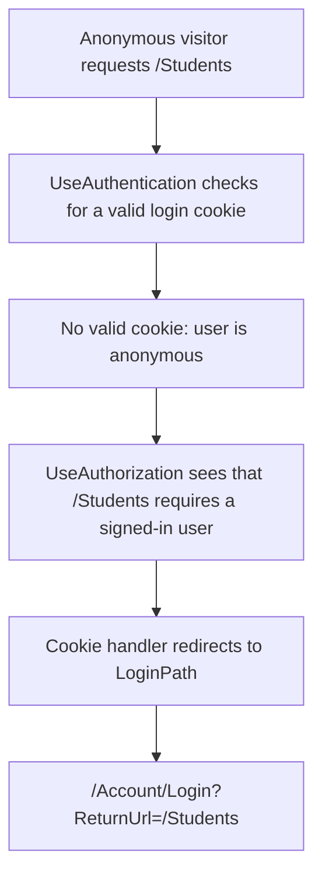

  

The configured cookie setting supplies the login route:

  

```csharp

options.LoginPath = "/Account/Login";

```

  

The `ReturnUrl` remembers where the visitor wanted to go. After a successful login, the Login Page Model can redirect them back to that local page.

  

## 3. Create the Admin-only policy

  

`Program.cs` defines a named policy:

  

```csharp

builder.Services.AddAuthorization(options =>

{

    options.AddPolicy("AdminOnly", policy => policy.RequireRole("Admin"));

});

```

  

Read this as:

  

```text

AdminOnly policy

→ the current signed-in user must have the Admin role

```

  

## 4. Apply Admin-only protection to whole management pages

  

Pages that change school data use this attribute on their Page Model:

  

```csharp

[Authorize(Policy = "AdminOnly")]

public class CreateModel : PageModel

```

  

These pages require an administrator:

  

| Area     | Admin-only pages             |
| -------- | ---------------------------- |
| Students | Create, Edit, Delete, Enroll |
| Courses  | Create, Edit, Delete         |

  

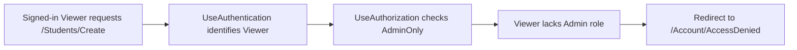

  

The access-denied redirect uses:

  

```csharp

options.AccessDeniedPath = "/Account/AccessDenied";

```

  

The important contrast is:

  

```text

Anonymous user requests protected page

→ redirect to Login

  

Signed-in Viewer requests Admin-only page

→ redirect to Access Denied

```

  

## 5. ⚠️ Special case: one protected handler on an otherwise viewable page


>📛***First thing to do: Inject `IAuthorizationService authorizationService` to the class that contains the forbidden POST and use it in the POST handler***


`Students/Details` should be available to both `Admin` and `Viewer`. Therefore, the whole Page Model cannot use `[Authorize(Policy = "AdminOnly")]`.

  

However, its Remove Enrollment POST handler changes data, so it checks authorization inside that handler:
  
```csharp

var authorizationResult =

    await authorizationService.AuthorizeAsync(User, "AdminOnly");

  

if (!authorizationResult.Succeeded)

{

    return Forbid();

}

```

  
`IAuthorizationService` is injected into `DetailsModel`:


```csharp

public class DetailsModel(

    SchoolDataService schoolData,

    IAuthorizationService authorizationService) : PageModel

```

  

Trace of a Viewer manually sending a removal request:

  
```text

Viewer sends POST /Students/Details/... RemoveEnrollment request

→ OnPostRemoveEnrollmentAsync runs

→ AuthorizeAsync checks AdminOnly

→ Viewer is not in Admin role

→ return Forbid()

→ removal code never runs

```

This protects the action even if someone bypasses the visual interface and manually constructs a POST request.

  

## 6. Interface changes are not the security rule

  

The shared pages use role checks such as:

  

```razor

@if (User.IsInRole("Admin"))

{

    // Render Add, Edit, Delete, Enroll, or Remove controls.

}

```

  

| User | Visible interface |
| --- | --- |
| Admin | Can see management buttons and actions. |
| Viewer | Can see lists and details, but not management controls. |

  
This prevents confusing buttons from appearing for Viewers. But a hidden button is not protection: a visitor can still type a URL or send a request directly. The `[Authorize]` attributes and `AuthorizeAsync` handler check are the real protection.

  

## Complete end-to-end flow

This chart connects all six steps. Read the setup flow first, then follow what happens when the application starts and receives browser requests.

```mermaid
flowchart TD
    subgraph Setup["One-time application and database setup"]
        UserModel["ApplicationUser inherits IdentityUser"]
        DbContext["SchoolDbContext inherits<br/>IdentityDbContext&lt;ApplicationUser&gt;"]
        Services["Register Identity services,<br/>EF stores, roles, tokens, and cookie routes"]
        Migration["Create and apply AddIdentity migration"]
        Database[("PostgreSQL<br/>Identity tables")]

        UserModel --> DbContext --> Services --> Migration --> Database
    end

    subgraph Startup["Each application startup"]
        Build["Build application and DI container"]
        Seeder["Run IdentityDataSeeder"]
        EnsureRoles["Ensure Admin and Viewer roles exist"]
        Credentials{"Admin credentials<br/>configured?"}
        EnsureAdmin["Create admin account if missing<br/>and assign Admin role"]
        Ready["Begin handling requests"]

        Build --> Seeder --> EnsureRoles --> Credentials
        Credentials -- Yes --> EnsureAdmin --> Ready
        Credentials -- No --> Ready
        Database -. stores seeded data .-> EnsureRoles
    end

    Services -. provides managers and cookie configuration .-> Build

    subgraph SignIn["Login"]
        LoginForm["Browser posts email, password,<br/>remember-me, and ReturnUrl"]
        Validate["LoginModel validates input"]
        SignInManager["SignInManager checks the account<br/>and verifies the password hash"]
        ValidCredentials{"Credentials valid?"}
        LoginError["Show a general login error"]
        CreateCookie["Create authentication cookie"]
        Redirect["Redirect to local ReturnUrl<br/>or home page"]

        LoginForm --> Validate --> SignInManager --> ValidCredentials
        ValidCredentials -- No --> LoginError
        ValidCredentials -- Yes --> CreateCookie --> Redirect
        Database -. account and password hash .-> SignInManager
    end

    Ready --> LoginForm

    subgraph Request["Every later protected-page request"]
        BrowserRequest["Browser requests a Razor Page"]
        Authentication["UseAuthentication reads<br/>and validates the cookie"]
        CurrentUser["Set HttpContext.User:<br/>anonymous, Viewer, or Admin"]
        Authorization["UseAuthorization checks<br/>the page rule or AdminOnly policy"]
        SignedIn{"Signed in?"}
        AnonymousAllowed{"Page allows<br/>anonymous access?"}
        LoginRedirect["Redirect to /Account/Login<br/>with ReturnUrl"]
        AdminRequired{"Admin role<br/>required?"}
        IsAdmin{"User is Admin?"}
        AccessDenied["Redirect to<br/>/Account/AccessDenied"]
        RunPage["Run the Razor Page handler"]
        RenderUI["Render UI:<br/>management controls only for Admin"]

        BrowserRequest --> Authentication --> CurrentUser --> Authorization --> SignedIn
        SignedIn -- No --> AnonymousAllowed
        AnonymousAllowed -- No --> LoginRedirect
        AnonymousAllowed -- Yes --> RunPage
        SignedIn -- Yes --> AdminRequired
        AdminRequired -- No --> RunPage
        AdminRequired -- Yes --> IsAdmin
        IsAdmin -- No --> AccessDenied
        IsAdmin -- Yes --> RunPage
        RunPage --> RenderUI
    end

    Redirect --> BrowserRequest
    LoginRedirect --> LoginForm

    subgraph HandlerCheck["Special case: protected POST on a shared page"]
        SharedPost["Viewer or Admin posts<br/>Remove Enrollment"]
        AuthorizeAsync["Handler calls AuthorizeAsync<br/>with AdminOnly"]
        HandlerAdmin{"User is Admin?"}
        Forbid["Return Forbid;<br/>do not change data"]
        ChangeData["Run removal code<br/>and change data"]

        SharedPost --> AuthorizeAsync --> HandlerAdmin
        HandlerAdmin -- No --> Forbid
        HandlerAdmin -- Yes --> ChangeData
    end

    RunPage -. shared Details page POST .-> SharedPost

    subgraph SignOut["Logout"]
        LogoutPost["Browser posts to /Account/Logout"]
        RemoveCookie["SignInManager.SignOutAsync<br/>removes the cookie"]
        Home["Redirect to home"]
        AnonymousNext["Next request is anonymous"]

        LogoutPost --> RemoveCookie --> Home --> AnonymousNext
    end

    RenderUI -. Admin or Viewer selects Sign out .-> LogoutPost
    AnonymousNext --> BrowserRequest
```

The central rule is: **Identity setup creates and stores accounts; authentication turns a valid cookie into `HttpContext.User`; authorization decides whether that user may run a page or action; UI role checks only decide which controls are visible.**

## Request-to-response layer trace

This sequence follows one browser request through the application's layers and then traces the response back to the browser. The response unwinds through the middleware in reverse order; those middleware layers do not repeat their incoming-request checks.

```mermaid
sequenceDiagram
    autonumber
    actor Browser
    participant Server as ASP.NET Core server
    participant Routing as UseRouting
    participant Logging as RequestLoggingMiddleware
    participant Authentication as UseAuthentication
    participant Authorization as UseAuthorization
    participant Policy as IAuthorizationService
    participant Razor as Razor Pages endpoint
    participant PageModel as Page Model / handler
    participant Service as SchoolDataService
    participant EF as SchoolDbContext / EF Core
    participant DB as PostgreSQL

    Browser->>Server: HTTP request + authentication cookie, if present
    Server->>Routing: Enter request pipeline
    Routing->>Routing: Match URL to a Razor Page endpoint
    Routing->>Logging: Pass request and matched endpoint
    Logging->>Logging: Begin request logging
    Logging->>Authentication: Pass request
    Authentication->>Authentication: Read and validate Identity cookie
    Authentication->>Authentication: Set HttpContext.User
    Authentication->>Authorization: Pass identified or anonymous user
    Authorization->>Authorization: Check page rule, role, or policy

    alt Anonymous user requests a protected page
        Authorization-->>Authentication: Challenge
        Authentication-->>Logging: Redirect to LoginPath with ReturnUrl
        Logging->>Logging: Finish request logging
        Logging-->>Routing: HTTP 302 response
        Routing-->>Server: Return response
        Server-->>Browser: Redirect to /Account/Login
    else Signed-in user lacks the required role
        Authorization-->>Authentication: Forbid
        Authentication-->>Logging: Redirect to AccessDeniedPath
        Logging->>Logging: Finish request logging
        Logging-->>Routing: HTTP 302 response
        Routing-->>Server: Return response
        Server-->>Browser: Redirect to /Account/AccessDenied
    else Request is authorized
        Authorization->>Razor: Run matched Razor Page
        Razor->>PageModel: Bind input and call OnGet/OnPost handler

        opt Handler needs school data
            PageModel->>Service: Request data or a data change
            Service->>EF: Query or update entities
            EF->>DB: Execute SQL
            DB-->>EF: Rows or update result
            EF-->>Service: Materialized entities or save result
            Service-->>PageModel: Application result
        end

        opt Shared page contains an Admin-only POST action
            PageModel->>Policy: AuthorizeAsync(User, "AdminOnly")
            Policy-->>PageModel: Succeeded or failed
            Note over PageModel,Service: On failure, return Forbid before changing data
        end

        PageModel-->>Razor: Page result, redirect, or forbidden result
        Razor->>Razor: Render HTML and role-appropriate controls
        Razor-->>Authorization: HTTP response
        Authorization-->>Authentication: Response unwinds
        Authentication-->>Logging: Response unwinds
        Logging->>Logging: Record status and finish logging
        Logging-->>Routing: Return response
        Routing-->>Server: Return response
        Server-->>Browser: HTML, redirect, or error response
    end
```

The layers have different responsibilities:

| Layer | Responsibility |
| --- | --- |
| Server and routing | Receive the HTTP request and select its endpoint. |
| Request logging | Observe and record the request and resulting response. |
| Authentication | Turn a valid Identity cookie into `HttpContext.User`. |
| Authorization | Decide whether that user may reach the endpoint or action. |
| Razor Page and Page Model | Bind input, run the handler, and produce a result. |
| Application service | Perform the application's school-data operation. |
| EF Core and PostgreSQL | Translate data operations into SQL and persist or retrieve data. |
| Response path | Carry the resulting HTML, redirect, forbidden result, or error back through the middleware to the browser. |

## Core request mental model

  

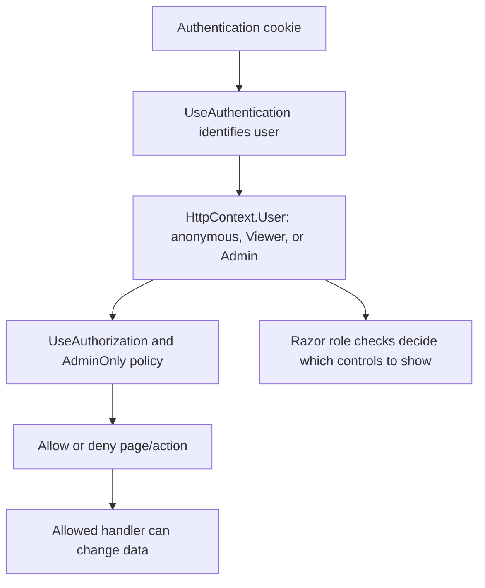

  

```text

Authentication → who are you?

Authorization  → are you allowed to do this?

UI checks      → which controls should you see?

```
