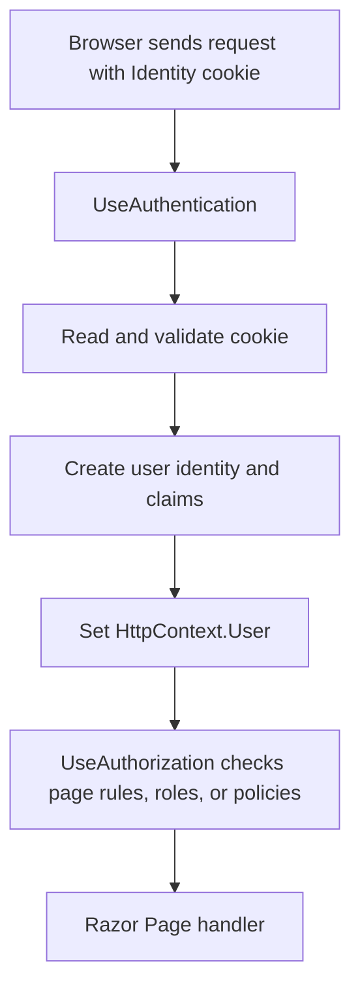

# `UseAuthentication()` in the request pipeline

Identity services and Identity database tables are not enough on their own. The request pipeline also needs middleware that reads a login cookie for every incoming request.

This line enables that step:

```csharp
app.UseAuthentication();
```

In this project it is correctly placed before authorization:

```csharp
app.UseRouting();
app.UseMiddleware<RequestLoggingMiddleware>();
app.UseAuthentication();
app.UseAuthorization();
app.MapRazorPages();
```

```text
Authentication answers: “Who is this request from?”
Authorization answers:  “Is this identified user allowed to do this?”
```

Authorization must come after authentication because it needs to know who the user is first.

## What happens for a signed-in user



Step by step:

```text
1. The browser sends a request, including its authentication cookie.
2. UseAuthentication uses the configured Identity cookie handler.
3. It reads and validates the cookie.
4. It builds the signed-in user's identity and claims.
5. It stores that identity in HttpContext.User for this request.
6. UseAuthorization can now inspect that user before the Razor Page runs.
```

## `HttpContext.User`

`HttpContext.User` holds a `ClaimsPrincipal`: the current request's user identity and related claims.

In a Razor Page Model, `User` is available through `PageModel`, so later code can ask:

```csharp
User.Identity?.Name
```

For an authenticated user, this can return their username. It can also be anonymous or have no name when no valid login cookie exists.

Role checks can ask, for example:

```csharp
User.IsInRole("Admin")
```

## What happens when no user is logged in?

```text
No cookie, or an invalid cookie
→ UseAuthentication leaves the request as anonymous
→ HttpContext.User has no authenticated identity
→ the page can still run if it allows anonymous users
```

`UseAuthentication()` does not create a login page and does not itself protect pages. A later `[Authorize]` rule or authorization policy decides whether an anonymous user may access an endpoint.

## Current state of this project

```text
Identity services are registered.
Identity tables exist in PostgreSQL.
UseAuthentication reads future login cookies.
No login page exists yet.
No user account exists yet.
No page requires authentication yet.
```

So this step prepares the request-pipeline behavior. It will become visible after later steps create users, sign them in, and protect pages.
