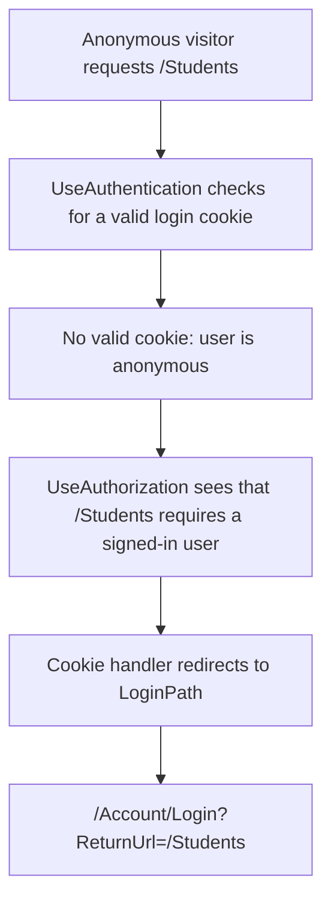
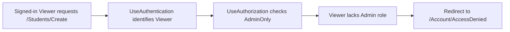
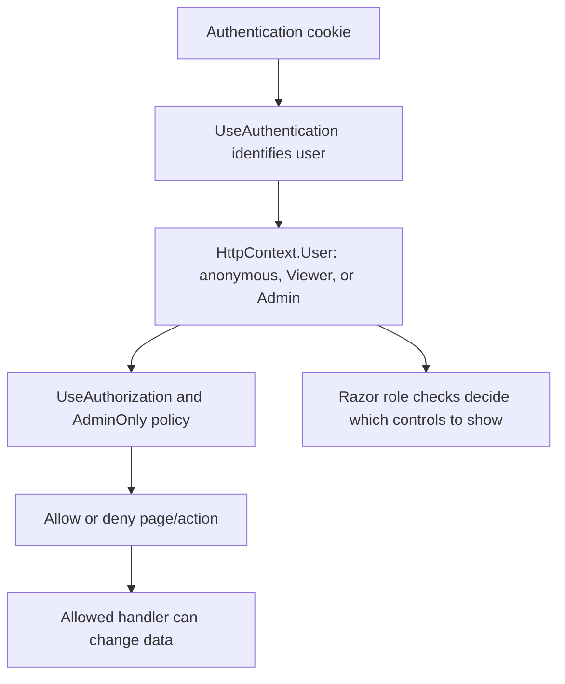

# Authorization: protecting pages and actions

Authentication identifies a user. **Authorization** decides what that identified user is allowed to access or change.

This project applies authorization in two layers:

```text
1. Server protection: authentication requirements and Admin-only rules.
2. Interface changes: show management controls only to administrators.
```

The server rules protect the data. Hiding controls improves the user experience but is not security by itself.

## 1. Require sign-in for every Razor Page by default

`Program.cs` configures Razor Pages like this:

```csharp
builder.Services.AddRazorPages(options =>
{
    options.Conventions.AuthorizeFolder("/");
    options.Conventions.AllowAnonymousToPage("/Account/Login");
    options.Conventions.AllowAnonymousToPage("/Error");
});
```

```csharp
options.Conventions.AuthorizeFolder("/");
```

means every page under `Pages/` requires an authenticated user unless an exception is configured.

| Page/route | Default rule | Who can access it? |
| --- | --- | --- |
| `/` | Authorized by folder convention | Any signed-in user |
| `/Students` | Authorized by folder convention | Any signed-in user |
| `/Courses` | Authorized by folder convention | Any signed-in user |
| `/Students/Details/1` | Authorized by folder convention | Any signed-in user |
| `/Account/Login` | Explicit anonymous exception | Anyone |
| `/Error` | Explicit anonymous exception | Anyone |

`LoginModel` and `ErrorModel` also use `[AllowAnonymous]`. The convention exceptions make the intended access rule explicit at application setup; the attributes make the Page Models explicitly anonymous too.

## 2. What happens for an anonymous visitor?



The configured cookie setting supplies the login route:

```csharp
options.LoginPath = "/Account/Login";
```

The `ReturnUrl` remembers where the visitor wanted to go. After a successful login, the Login Page Model can redirect them back to that local page.

## 3. Create the Admin-only policy

`Program.cs` defines a named policy:

```csharp
builder.Services.AddAuthorization(options =>
{
    options.AddPolicy("AdminOnly", policy => policy.RequireRole("Admin"));
});
```

Read this as:

```text
AdminOnly policy
→ the current signed-in user must have the Admin role
```

## 4. Apply Admin-only protection to whole management pages

Pages that change school data use this attribute on their Page Model:

```csharp
[Authorize(Policy = "AdminOnly")]
public class CreateModel : PageModel
```

These pages require an administrator:

| Area | Admin-only pages |
| --- | --- |
| Students | Create, Edit, Delete, Enroll |
| Courses | Create, Edit, Delete |



The access-denied redirect uses:

```csharp
options.AccessDeniedPath = "/Account/AccessDenied";
```

The important contrast is:

```text
Anonymous user requests protected page
→ redirect to Login

Signed-in Viewer requests Admin-only page
→ redirect to Access Denied
```

## 5. Special case: one protected handler on an otherwise viewable page

`Students/Details` should be available to both `Admin` and `Viewer`. Therefore, the whole Page Model cannot use `[Authorize(Policy = "AdminOnly")]`.

However, its Remove Enrollment POST handler changes data, so it checks authorization inside that handler:

```csharp
var authorizationResult =
    await authorizationService.AuthorizeAsync(User, "AdminOnly");

if (!authorizationResult.Succeeded)
{
    return Forbid();
}
```

`IAuthorizationService` is injected into `DetailsModel`:

```csharp
public class DetailsModel(
    SchoolDataService schoolData,
    IAuthorizationService authorizationService) : PageModel
```

Trace of a Viewer manually sending a removal request:

```text
Viewer sends POST /Students/Details/... RemoveEnrollment request
→ OnPostRemoveEnrollmentAsync runs
→ AuthorizeAsync checks AdminOnly
→ Viewer is not in Admin role
→ return Forbid()
→ removal code never runs
```

This protects the action even if someone bypasses the visual interface and manually constructs a POST request.

## 6. Interface changes are not the security rule

The shared pages use role checks such as:

```razor
@if (User.IsInRole("Admin"))
{
    // Render Add, Edit, Delete, Enroll, or Remove controls.
}
```

| User | Visible interface |
| --- | --- |
| Admin | Can see management buttons and actions. |
| Viewer | Can see lists and details, but not management controls. |

This prevents confusing buttons from appearing for Viewers. But a hidden button is not protection: a visitor can still type a URL or send a request directly. The `[Authorize]` attributes and `AuthorizeAsync` handler check are the real protection.

## Full mental model



```text
Authentication → who are you?
Authorization  → are you allowed to do this?
UI checks      → which controls should you see?
```
