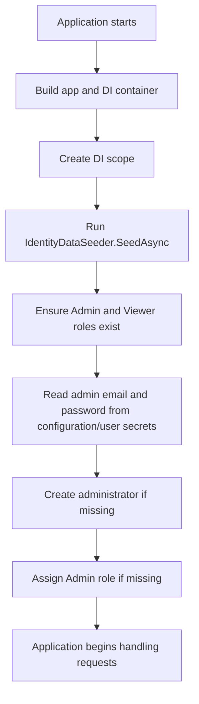
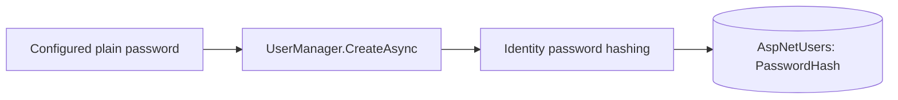

# Seeding initial Identity data

Seeding means creating required initial data automatically. In this project, the seeder creates:

```text
Admin role
Viewer role
Initial administrator account, when credentials are configured
Admin role assignment for that account
```

The code is in `Data/IdentityDataSeeder.cs`.

## When it runs

`Program.cs` runs the seeder after building the application but before accepting web requests:

```csharp
var app = builder.Build();

using (var scope = app.Services.CreateScope())
{
    await IdentityDataSeeder.SeedAsync(scope.ServiceProvider);
}
```



## Why create a DI scope?

Some Identity services and `SchoolDbContext` are scoped services. Normally, ASP.NET creates a scope for each web request.

At startup, there is no browser request yet. This line creates a short-lived startup scope instead:

```csharp
app.Services.CreateScope()
```

The seeder uses the scope's service provider:

```csharp
await IdentityDataSeeder.SeedAsync(scope.ServiceProvider);
```

When the `using` block ends, the startup scope and its scoped services are disposed.

## Services used by the seeder

```csharp
var roleManager = serviceProvider.GetRequiredService<RoleManager<IdentityRole>>();
var userManager = serviceProvider.GetRequiredService<UserManager<ApplicationUser>>();
var configuration = serviceProvider.GetRequiredService<IConfiguration>();
```

| Service | Job |
| --- | --- |
| `RoleManager<IdentityRole>` | Finds and creates role records such as `Admin` and `Viewer`. |
| `UserManager<ApplicationUser>` | Finds and creates user accounts, hashes passwords, and assigns roles. |
| `IConfiguration` | Reads configured seed values, including user secrets in development. |
| `ILoggerFactory` | Creates a logger so the seeder can report what it created or why it skipped the admin account. |

The seeder is a static method started manually during app startup, so it gets its needed services from the supplied `IServiceProvider`. Page Models instead normally receive services through constructor injection.

## 1. Ensure the roles exist

```csharp
private static readonly string[] RoleNames = ["Admin", "Viewer"];

foreach (var roleName in RoleNames)
{
    if (!await roleManager.RoleExistsAsync(roleName))
    {
        var roleResult = await roleManager.CreateAsync(new IdentityRole(roleName));
        EnsureSucceeded(roleResult, $"create the {roleName} role");
    }
}
```

For each role:

```text
Role already exists
→ do nothing

Role does not exist
→ create it in AspNetRoles
```

## 2. Read the administrator credentials safely

```csharp
var adminEmail = configuration["IdentitySeed:AdminEmail"];
var adminPassword = configuration["IdentitySeed:AdminPassword"];
```

The values are expected under these configuration keys:

```text
IdentitySeed:AdminEmail
IdentitySeed:AdminPassword
```

They belong in user secrets during local development, not in C# code or a Git-tracked settings file.

If either value is missing:

```csharp
if (string.IsNullOrWhiteSpace(adminEmail) || string.IsNullOrWhiteSpace(adminPassword))
{
    logger.LogWarning(...);
    return;
}
```

The roles can still be created, but the administrator account is skipped.

## 3. Create the administrator only if needed

```csharp
var administrator = await userManager.FindByEmailAsync(adminEmail);

if (administrator is null)
{
    administrator = new ApplicationUser
    {
        UserName = adminEmail,
        Email = adminEmail,
        EmailConfirmed = true
    };

    var userResult = await userManager.CreateAsync(administrator, adminPassword);
    EnsureSucceeded(userResult, "create the initial administrator account");
}
```

`UserManager.CreateAsync(administrator, adminPassword)` receives the plain password only temporarily. Identity hashes it securely and stores the resulting hash in `AspNetUsers`; it does not store the original password.



## 4. Assign the Admin role only if needed

```csharp
if (!await userManager.IsInRoleAsync(administrator, "Admin"))
{
    var roleResult = await userManager.AddToRoleAsync(administrator, "Admin");
    EnsureSucceeded(roleResult, "assign the Admin role to the initial administrator account");
}
```

This creates the user/role relationship in the Identity database tables.

```text
ApplicationUser
→ Admin role
→ AspNetUserRoles record
```

## Why it is safe to run at every startup

The seeder checks before creating anything:

| Data | Check |
| --- | --- |
| Role | `RoleExistsAsync(roleName)` |
| Administrator | `FindByEmailAsync(adminEmail)` |
| Admin assignment | `IsInRoleAsync(administrator, "Admin")` |

This makes the seeder **idempotent**: running it again produces the same final database state instead of adding duplicates.

## Error handling

```csharp
EnsureSucceeded(result, "...");
```

checks Identity operation results. If an operation fails, it gathers the Identity error descriptions and throws an exception. This prevents the application from quietly continuing with incomplete required seed data.
