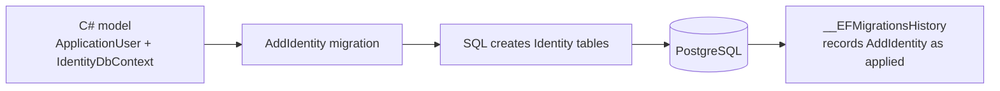

# Applying the AddIdentity migration

This step makes the Identity setup real in PostgreSQL.

Before the migration:

```text
C# code knew about ApplicationUser and Identity.
PostgreSQL did not yet have Identity tables.
```

After applying the migration:

```text
C# code knows about Identity.
PostgreSQL now has Identity tables too.
```

## The two separate steps

Creating a migration and applying a migration are different operations.

```text
dotnet ef migrations add AddIdentity
→ EF Core compares the current C# model with the previous EF migration snapshot.
→ EF Core creates migration code describing the needed database changes.

dotnet ef database update
→ EF Core checks __EFMigrationsHistory in PostgreSQL.
→ It sees AddIdentity was not applied.
→ It runs that migration's SQL against PostgreSQL.
→ It records the migration as applied.
```



## Identity tables created

| Table | Purpose |
| --- | --- |
| `AspNetUsers` | Stores login accounts, email, username, password hash, and related account values. |
| `AspNetRoles` | Stores roles such as `Admin` or `Viewer`. |
| `AspNetUserRoles` | Connects users to roles. |
| `AspNetUserClaims` and `AspNetRoleClaims` | Stores extra permission and identity information. |
| `AspNetUserLogins` | Stores external-login information, if the app uses it. |
| `AspNetUserTokens` | Stores Identity token-related information. |

## Important result

```text
The tables now exist,
```

The migration creates the empty database structure. It does not automatically create an admin user or any other account. Those records will be added in a later step.
