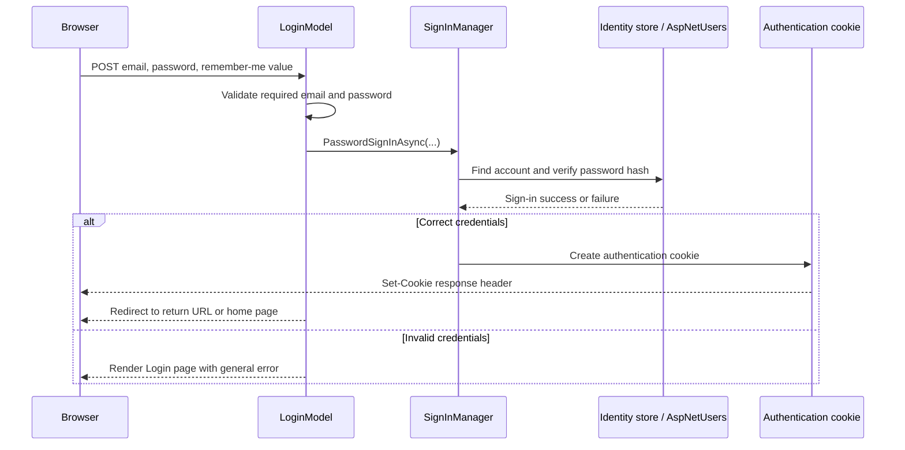
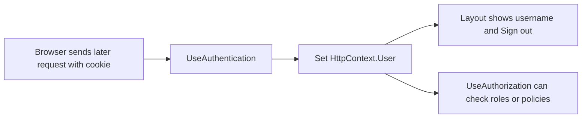

# Login and logout pages

This step adds Razor Pages that start and end an authenticated session.

```text
Login  → verify credentials and create an authentication cookie
Logout → remove the authentication cookie
```

The earlier Identity setup already registered Identity services, created Identity database tables, and added `UseAuthentication()` to the request pipeline. These pages now use those pieces.

## Login page files

```text
Pages/Account/Login.cshtml     → the HTML login form
Pages/Account/Login.cshtml.cs  → the login request handling
```

## The login form

The form sends these values with a POST request:

```text
Email
Password
Remember me
Return URL, if one exists
```

```razor
<form method="post" class="auth-form">
    <input type="hidden" asp-for="ReturnUrl" />
    <input asp-for="Input.Email" />
    <input asp-for="Input.Password" />
    <input asp-for="Input.RememberMe" />
    <button type="submit">Sign in</button>
</form>
```

`asp-for` connects each input to the Login Page Model's `Input` property.

## The Login Page Model receives `SignInManager`

```csharp
public class LoginModel(SignInManager<ApplicationUser> signInManager)
    : PageModel
```

`SignInManager<ApplicationUser>` is provided through dependency injection. `AddIdentity<ApplicationUser, IdentityRole>(...)` registered this Identity service earlier.

Its job includes safely handling sign-in operations:

```text
find the configured Identity user
verify the submitted password against its stored password hash
create or remove authentication cookies
```

The application never reads, compares, or stores a plain-text password itself.

## Login request flow



The main call is:

```csharp
var result = await signInManager.PasswordSignInAsync(
    Input.Email,
    Input.Password,
    Input.RememberMe,
    lockoutOnFailure: false);
```

| Argument | Meaning |
| --- | --- |
| `Input.Email` | The Identity username for this project. The planned seeded users use their email as their username. |
| `Input.Password` | The password the user submitted. Identity verifies it against a secure stored hash. |
| `Input.RememberMe` | Chooses whether the login cookie should persist on the device. |
| `lockoutOnFailure: false` | Failed attempts do not currently contribute to account lockout. |

When the result succeeds:

```csharp
return LocalRedirect(ReturnUrl ?? Url.Content("~/"));
```

`ReturnUrl` is where the user originally wanted to go. `LocalRedirect` only permits a local URL in this application, which helps prevent redirects to an untrusted external site.

## Later requests after login



`UseAuthentication()` reads the cookie on each later request. The shared layout can then use:

```razor
@if (User.Identity?.IsAuthenticated == true)
{
    <span>@User.Identity.Name</span>
}
```

That produces two navigation states:

```text
Anonymous user  → Sign in link
Signed-in user  → username and Sign out button
```

## Logout

The layout uses a POST form:

```razor
<form method="post" asp-page="/Account/Logout">
    <button type="submit">Sign out</button>
</form>
```

The Logout Page Model runs:

```csharp
public async Task<IActionResult> OnPostAsync()
{
    await signInManager.SignOutAsync();
    return RedirectToPage("/Index");
}
```

`SignOutAsync()` removes the authentication cookie. On the next request, `UseAuthentication()` finds no valid login cookie, so the browser is anonymous again.

```text
Signed-in browser
→ POST /Account/Logout
→ SignOutAsync removes cookie
→ redirect to dashboard
→ later request has no valid authentication cookie
→ User.Identity.IsAuthenticated is false
```

The `OnGet()` handler on the logout page only redirects home:

```csharp
public IActionResult OnGet()
{
    return RedirectToPage("/Index");
}
```

This prevents a normal GET link/visit from signing someone out. Logout changes session state, so using POST is the appropriate HTTP action.

## Current limitation

The login and logout code is ready, but no real account or role has been created yet. Until a user is seeded or registered, every login attempt will fail. The next step can seed roles such as `Admin` and `Viewer`, plus the first administrator account.
