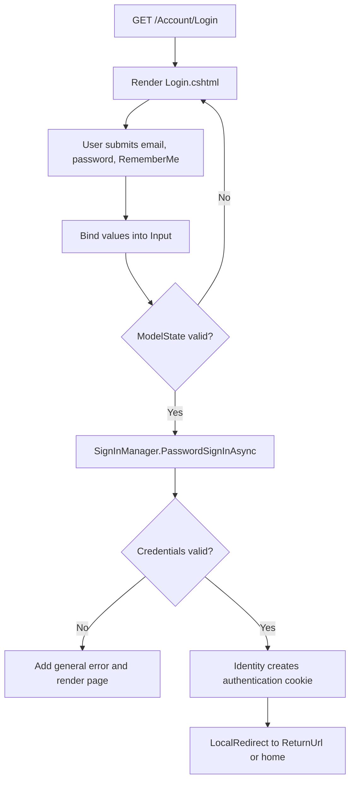

# Razor Pages Identity login template

Use this as a starting template for a Razor Pages login page that uses ASP.NET Core Identity.

## Prerequisites

Before this template can work, the application needs:

```csharp
builder.Services.AddIdentity<ApplicationUser, IdentityRole>()
    .AddEntityFrameworkStores<SchoolDbContext>()
    .AddDefaultTokenProviders();
```

And the request pipeline needs:

```csharp
app.UseAuthentication();
app.UseAuthorization();
```

Identity database migrations must also have been applied and at least one user must exist.

## `Login.cshtml.cs`

```csharp
using System.ComponentModel.DataAnnotations;
using Microsoft.AspNetCore.Authorization;
using Microsoft.AspNetCore.Identity;
using Microsoft.AspNetCore.Mvc;
using Microsoft.AspNetCore.Mvc.RazorPages;

namespace YourProject.Pages.Account;

[AllowAnonymous]
public class LoginModel(SignInManager<ApplicationUser> signInManager) : PageModel
{
    [BindProperty]
    public InputModel Input { get; set; } = new();

    [BindProperty(SupportsGet = true)]
    public string? ReturnUrl { get; set; }

    public void OnGet()
    {
    }

    public async Task<IActionResult> OnPostAsync()
    {
        if (!ModelState.IsValid)
        {
            return Page();
        }

        SignInResult result = await signInManager.PasswordSignInAsync(
            Input.Email,
            Input.Password,
            Input.RememberMe,
            lockoutOnFailure: false);

        if (result.Succeeded)
        {
            return LocalRedirect(ReturnUrl ?? Url.Content("~/"));
        }

        ModelState.AddModelError(string.Empty, "The email or password is incorrect.");
        return Page();
    }

    public class InputModel
    {
        [Required(ErrorMessage = "Email is required.")]
        [EmailAddress(ErrorMessage = "Enter a valid email address.")]
        public string Email { get; set; } = string.Empty;

        [Required(ErrorMessage = "Password is required.")]
        [DataType(DataType.Password)]
        public string Password { get; set; } = string.Empty;

        public bool RememberMe { get; set; }
    }
}
```

## `Login.cshtml`

```razor
@page
@model YourProject.Pages.Account.LoginModel
@{
    ViewData["Title"] = "Sign in";
}

<h1>Sign in</h1>

<form method="post">
    <input type="hidden" asp-for="ReturnUrl" />

    <div asp-validation-summary="ModelOnly" role="alert"></div>

    <div>
        <label asp-for="Input.Email"></label>
        <input asp-for="Input.Email" autocomplete="email" />
        <span asp-validation-for="Input.Email"></span>
    </div>

    <div>
        <label asp-for="Input.Password"></label>
        <input asp-for="Input.Password" autocomplete="current-password" />
        <span asp-validation-for="Input.Password"></span>
    </div>

    <label>
        <input asp-for="Input.RememberMe" />
        Keep me signed in on this device
    </label>

    <button type="submit">Sign in</button>
</form>
```

## Request trace



## What each part does

| Part | Purpose |
| --- | --- |
| `SignInManager<ApplicationUser>` | Identity service that verifies the password safely and creates the authentication cookie. |
| `[BindProperty] Input` | Receives submitted email, password, and RememberMe values. |
| `InputModel` | Keeps login-form input separate from the database user entity. |
| `ReturnUrl` | Remembers the local page a user tried to access before login. |
| `LocalRedirect(...)` | Redirects only to a URL inside this application. |
| `RememberMe` | Requests a persistent login cookie. |
| `ModelState.AddModelError(...)` | Displays a general login error without revealing whether the email or password was wrong. |

## Safety reminders

```text
Do not compare or store plain-text passwords yourself.
Use SignInManager and Identity's password hashing.
Use POST for the login form.
Use LocalRedirect for a supplied ReturnUrl.
Do not reveal whether a submitted email account exists.
```

If this project uses emails as Identity usernames, pass `Input.Email` as shown. If it uses a separate username, replace that first argument with the appropriate username property.
