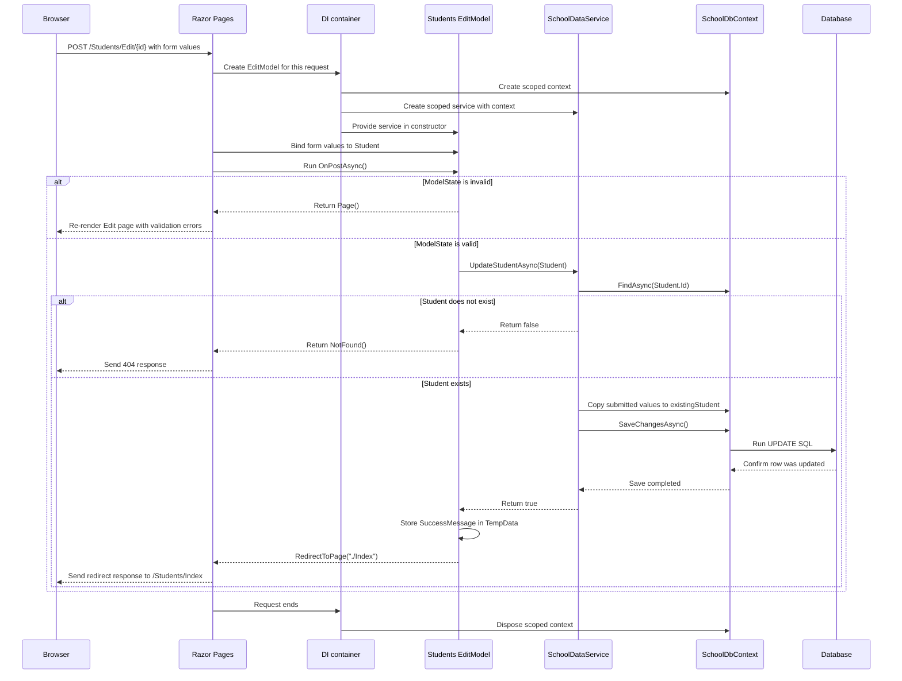

# Request trace: POST Students/Edit

This trace follows a valid submission of the **Edit student** form. The
alternative paths show what happens when validation fails or the student no
longer exists.

When validation fails, `return Page()` keeps the learner on the Edit page so
Razor Pages can display validation messages. If the student no longer exists,
the handler returns a 404 response. When validation succeeds, the service finds
the existing row using the submitted `Student.Id`, copies the editable values,
saves the update, stores a one-time success message in `TempData`, and redirects
to the Index page. The browser follows that redirect with a new GET request,
which creates and later disposes its own scoped services.
