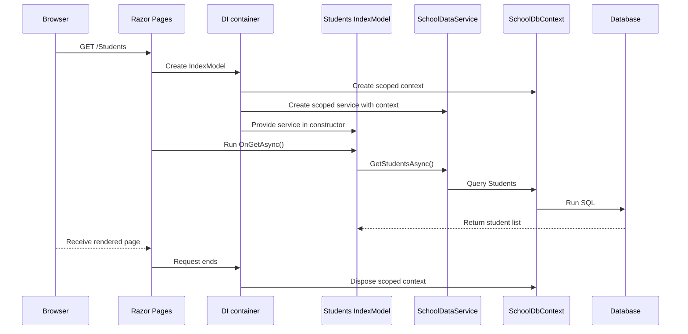

# Request trace GET Students

```mermaid

sequenceDiagram

    participant Browser

    participant Razor as Razor Pages

    participant DI as DI container

    participant Page as Students IndexModel

    participant Service as SchoolDataService

    participant Context as SchoolDbContext

    participant Db as Database

  

    Browser->>Razor: GET /Students

    Razor->>DI: Create IndexModel

    DI->>Context: Create scoped context

    DI->>Service: Create scoped service with context

    DI->>Page: Provide service in constructor

    Razor->>Page: Run OnGetAsync()

    Page->>Service: GetStudentsAsync()

    Service->>Context: Query Students

    Context->>Db: Run SQL

    Db-->>Page: Return student list

    Browser-->>Razor: Receive rendered page

    Razor->>DI: Request ends

    DI->>Context: Dispose scoped context

```